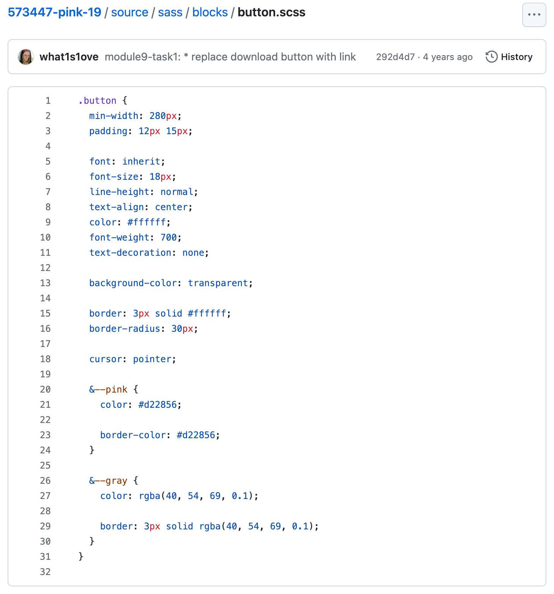

When I was starting to learn web development, pure CSS often remained in the realm of theory. When it came to practice, especially working on real projects, pure CSS was a rarity. The market and the industry itself dictated that styles should be written using preprocessors.

Fortunately, over time, this trend has almost disappeared. Pure CSS now includes many features that were previously missing, causing people to prefer preprocessors.

Even though I have not used preprocessors for a long time, at least in my personal projects, there is one thing I missed while working with them: using the [parent selector](https://sass-lang.com/documentation/style-rules/parent-selector/) to create modifiers when using the [BEM methodology](https://en.bem.info/methodology/css/). I thought for a long time that I would never be able to avoid duplicating the full selector when writing modifiers in pure CSS. However, while redesigning my website, I found a convenient way for myself to write BEM modifiers using native CSS nesting.

## My Path with BEM & SCSS

I hate preprocessors. Be it [SASS](https://sass-lang.com/documentation/syntax/#the-indented-syntax), [SCSS](https://sass-lang.com/documentation/syntax/#scss), [LESS](https://lesscss.org/), [Stylus](https://stylus-lang.com/), or any other. Really, without any exceptions. Though, I think my hatred for preprocessors is not because of the technology itself, but because of how other people use them. Throughout my development career, I have often encountered tickets where a seemingly simple task, like changing the text size, which should take minutes, ended up taking me hours. This is because people often want to use the tool to its full extent. As a result, to find where I needed to change the text size in _projects using preprocessors to the max_, I had to go through several mixins, maybe a loop or even nested loops, and several nested selectors using the parent selector. Brr, just thinking about it gives me the shivers.

Like many who started their careers during the peak popularity of preprocessors, I initially did not spend much time on pure CSS. The industry, including the job market, dictated the need for preprocessor knowledge, and mentions of pure CSS in job listings were rare. I was no exception, and almost from the beginning of my learning journey, I began writing styles using SCSS. I was very fortunate with my mentors, as they instilled in me a great love for pure CSS, despite the use of preprocessors. SCSS was chosen deliberately because it closely resembles pure CSS compared to other preprocessors. Additionally, out of all the features preprocessors offer, we used only two: compiling all `.scss` files into one file and nesting with the parent selector, exclusively for pseudo-classes/pseudo-elements and creating [modifiers](https://en.bem.info/methodology/css/#modifiers) using the BEM methodology. All other preprocessor features, such as loops and mixins, were forbidden, as they were meant to solve specific problems rather than being used _just because they exist_.

<figure>
  
  <figcaption>For what purpose I used SCSS when I was learning.</figcaption>
</figure>

Later on, after my training, almost all of my work projects involved some preprocessor. It was during these experiences that I developed my strong dislike for preprocessors. In my personal projects, however, I never used preprocessors and wrote everything in pure CSS, adding precise enhancements through plugins for my `.css` bundler. For example, in the past, when I was bundling my `.css` files using [PostCSS](https://postcss.org/), I used a simple plugin called [postcss-import](https://www.npmjs.com/package/postcss-import) to bundle all `.css` files into one final file (such as in this blog. Here is [one of the first commits in this repository](https://github.com/what1s1ove/whatislove.dev/commit/15eb16e2de4ddfd9c72fe39503351650bfdc5eab#diff-25789e3ba4c2adf4a68996260eb693a441b4a834c38b76167a120f0b51b969f7R34)). I rarely used any additional plugins for CSS.

I always tried to avoid nesting in preprocessors wherever possible, but with the introduction of native CSS nesting, I gradually began incorporating it into my personal projects. It seems to me that native CSS nesting works more intuitively and correctly compared to nesting in preprocessors. One key difference with native CSS nesting compared to preprocessor nesting is that it does not have the functionality of a parent selector to create _new selectors._ This is what I used during my training for BEM modifiers, and it was perhaps the only thing I started to miss when using native CSS nesting.

## Native CSS Nesting Modifiers

Before native CSS nesting became available, I had to describe all class modifiers with separate selectors. During those times, I particularly missed the functionality of creating a new selector using the parent selector in preprocessors. This was because the full selector for a modifier could be duplicated dozens of times.

```css
.tag-list__tag {
  --background-color: var(--color-red-200);

  padding-block: 2px;
  padding-inline: 6px;
  background-color: hsl(var(--background-color) / 30%);
}

.tag-list__tag--html {
  --background-color: var(--color-green-100);
}

.tag-list__tag--github {
  --background-color: var(--color-gray-100);
}

.tag-list__tag--ts {
  --background-color: var(--color-blue-200);
}
```

But even with the introduction of native CSS nesting, I did not immediately solve this problem because native CSS nesting simply does not have anything functionally similar to creating a new selector through the parent selector functionality found in preprocessors.

The first thing I started using more actively was various attributes, such as `aria-current="page"`, `rel="prev"`/`rel="next"`, `name`, and others. Just this alone significantly helped reduce the number of class modifiers. However, not all modifiers can be covered with attributes, and in my code, there still remained a sizable number of places where the selector was duplicated entirely to create a BEM modifier.

I tried googling for solutions because BEM methodology markup is quite popular, but all the code examples and repositories I found were doing the same thing – simply duplicating the entire selector.

One day, as I was adding new modifiers and duplicating the entire selector, I decided to experiment. Like everyone starting out with CSS, I learned about [attribute selectors](https://developer.mozilla.org/en-US/docs/Web/CSS/Attribute_selectors). I was no exception and went through that section, but truthfully, I rarely used these selectors. However, I completely forgot that attribute selectors can be used with any attribute, including `class` (because it is odd to use an attribute selector for a `class` when you can just use a class selector, right?). Then it struck me – I also remembered about additional operators available in attribute selectors, specifically [substring matching selectors](https://developer.mozilla.org/en-US/docs/Learn/CSS/Building_blocks/Selectors/Attribute_selectors#substring_matching_selectors), which work perfectly with native CSS nesting. Here is how it looks:

```css
.tag-list__tag {
  --background-color: var(--color-red-200);

  padding-block: 2px;
  padding-inline: 6px;
  background-color: hsl(var(--background-color) / 30%);

  &[class*='--html'] {
    --background-color: var(--color-green-100);
  }

  &[class*='--github'] {
    --background-color: var(--color-gray-100);
  }

  &[class*='--ts'] {
    --background-color: var(--color-blue-200);
  }
}
```

It turned out quite close to the modifiers that I used to write using the parent selector in SCSS at the beginning of my learning, didn't it?

Perhaps not as concise as using the parent selector to create new selectors in preprocessors, but personally, I prefer the approach with native CSS nesting and attribute selectors paired with substring matching selectors much more. As I mentioned earlier, native CSS nesting is much clearer and more logical to me in understanding.

[Here](https://github.com/what1s1ove/whatislove.dev/pull/553/files#diff-ca25b3b88b76bdb99b160aeab08b9a6aaa5428df4fe8ad55834db5c67a74f24e) you can find the PR where I applied this trick across my entire project.

## Conclusion

I love CSS and all its functionality. It is gratifying to see how the foundational aspects of CSS from the very beginning seamlessly complement the new functionalities emerging within it. Moreover, this synergy works in both directions.

I have never been part of the group of people who say that native CSS should incorporate everything found in tools like SASS or other preprocessors. To me, these are different tools, and this small trick using attribute selectors together with substring matching selectors in native CSS nesting for BEM modifiers `&[class*="--modifier"]` has finally fulfilled all my wishes that I had when using SCSS and other preprocessors. However, CSS continues to evolve, and on the horizon, we can already see [native CSS mixins](https://github.com/w3c/csswg-drafts/issues/9350) (one of the reasons why I always reluctantly talk about SCSS or other preprocessors).

Once upon a time, when native CSS nesting was just starting to be discussed, I thought, "Nesting? In pure CSS? I will never use that!" But over time, I got used to it, and now I even like it. Will the same happen with native CSS mixins, or, heaven forbid, native CSS loops? I want to say no, but I will not make predictions. At the very least, with experience, I have become acquainted with a wonderful tool like [Stylelint](https://stylelint.io/) and its life-easing rules such as [max-nesting-depth](https://stylelint.io/user-guide/rules/max-nesting-depth/) and others. Hopefully, it will prevent me from becoming a hater of pure CSS someday.
