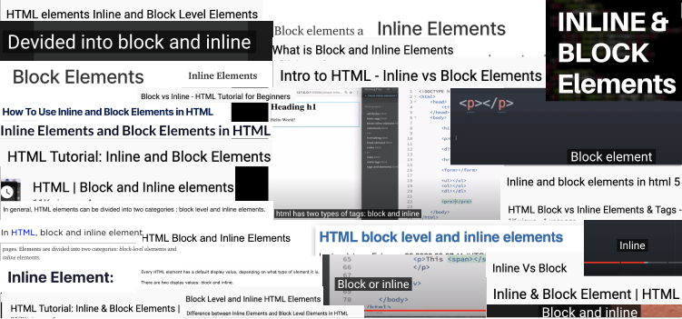
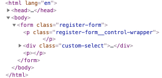
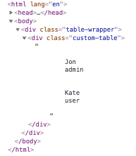
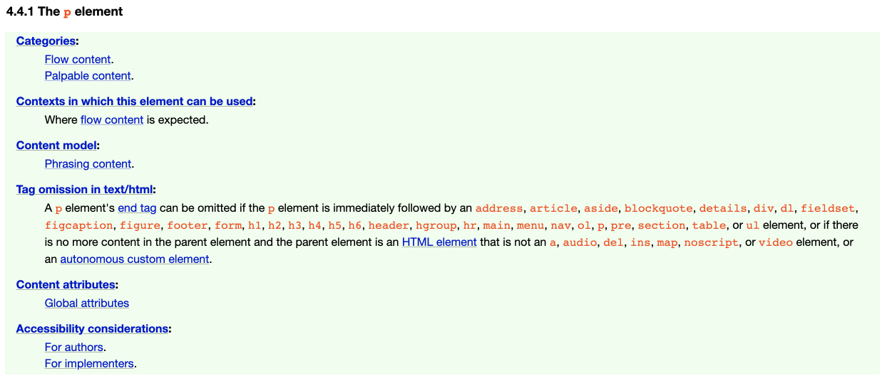
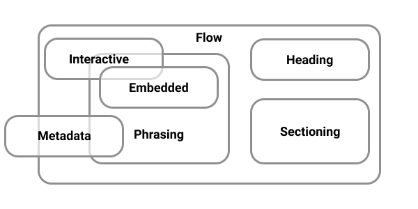
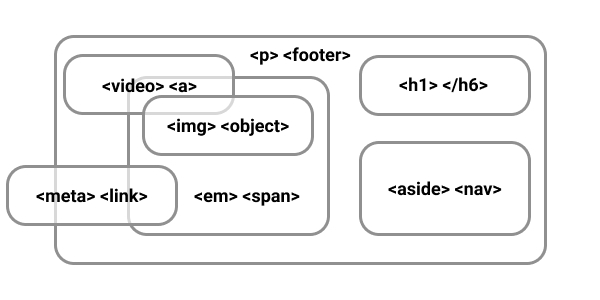
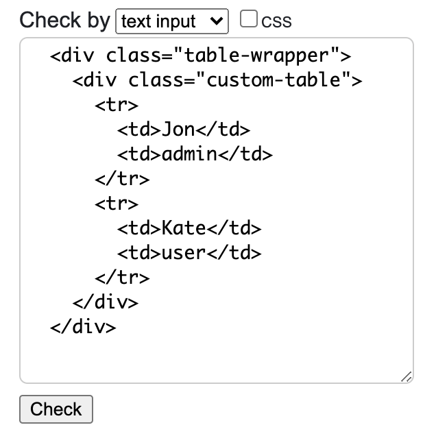
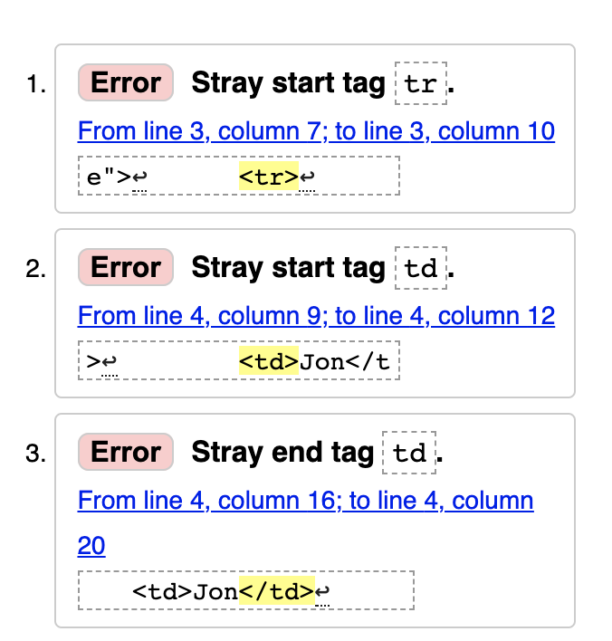
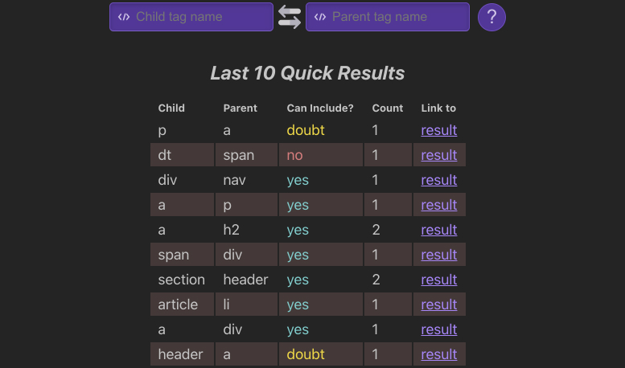

Have you ever encountered unexpected rendering issues in your HTML documents? Perhaps you've found elements behaving strangely or not displaying as intended. This common frustration often stems from incorrect nesting of HTML tags. Many people believe there are only two types of HTML tags — block and inline. However, this is a misconception. Whether you're a seasoned web developer or just starting, mastering the proper nesting of HTML elements is essential for building well-structured web pages that behave as expected. Let's get started by uncovering the root of these issues and learning how to avoid them.



This image contains around 50 screenshots from random articles and courses, where the authors state that tags in HTML are divided into two types — block and inline.

**This is wrong.**

HTML tags are divided into **7** types. In this article we will learn about them and how to use them correctly.

## The Problem

Let's imagine that we have a task where we need to make a markup of a form. Something like this:

```jsx
// src/components/sign-up/components/register-form/register-form.jsx

<form className="register-form">
  <p className="register-form__control-wrapper">
    <CustomSelect label="Type:" options={[]} />
  </p>
</form>
```

`CustomSelect` markup:

```jsx
// src/components/common/custom-select/custom-select.jsx

const CustomSelect = ({ label, options }) => (
  <div className="custom-select">
    <label className="custom-select__label">
      {label}
      <select className="custom-select__control">
        {options.map((it) => (
          <option value={it.value}>{it.label}</option>
        ))}
      </select>
    </label>
  </div>
)
```

But when we open the browser we see this:



Hmm, the custom select component outside of the `p` element? An extra `p` appeared?

One more example:

```jsx
// src/components/sign-up/components/users/users.jsx

<div className="table-wrapper">
  <CustomTable>
    {users.map((user) => (
      <tr>
        <td>{user.name}</td>
        <td>{user.role}</td>
      </tr>
    ))}
  </CustomTable>
</div>
```

`CustomTable` markup:

```jsx
// src/components/common/custom-table/custom-table.jsx

const CustomTable = ({ children }) => (
  <div className="custom-table">{children}</div>
)
```

Let's open a browser:



What is going on...

This is how the browser behaves when we try to nest one element incorrectly within another.

## 7 types of HTML Element

Each element in HTML falls into zero or more categories that group elements with similar characteristics together and has its own content model and other nuances and features. For example, [the p element](https://html.spec.whatwg.org/multipage/grouping-content.html#the-p-element):



HTML Element content types:

- [Metadata content](https://html.spec.whatwg.org/multipage/dom.html#metadata-content-2) — information for browsers, search engines and etc. (everything in the `<head>`);
- [Flow content](https://html.spec.whatwg.org/multipage/dom.html#flow-content-2) — content (everything in the `<body>`);
- [Phrasing content](https://html.spec.whatwg.org/multipage/dom.html#phrasing-content-2) — document text and small text elements in paragraphs;
- [Sectioning content](https://html.spec.whatwg.org/multipage/dom.html#sectioning-content-2) — semantic sections of the document;
- [Heading content](https://html.spec.whatwg.org/multipage/dom.html#heading-content-2) — headlines;
- [Embedded content](https://html.spec.whatwg.org/multipage/dom.html#embedded-content-category) — images, video, audio and etc;
- [Interactive content](https://html.spec.whatwg.org/multipage/dom.html#interactive-content-2) — what the user is interacting with.

<figure>
	
	<figcaption>HTML Element content types</figcaption>
</figure>

<figure>
	
	<figcaption>HTML Element content types</figcaption>
</figure>

_When you try to nest one tag in another incorrectly, browser starts fixing errors **at its discretion without asking**._

## Let's play. Can `<x>` be nested in `<y>`?

Open the [documentation](https://html.spec.whatwg.org/multipage/semantics.html#semantics) and try to find the answer yourself 😉

```html
<li>
  <p>?</p>
</li>
```

<details>
	<summary>Spoiler</summary>

    **Yes, you can!**

    [The `li` element](https://html.spec.whatwg.org/multipage/grouping-content.html#the-li-element) content model — `flow content`.

    [The `p` element](https://html.spec.whatwg.org/multipage/grouping-content.html#the-p-element) categories — `flow content`, `palpable content`.

</details>

```html
<header>
  <section>?</section>
</header>
```

<details>
  <summary>Spoiler</summary>

    **Yes, you can!**

    [The `header` element](https://html.spec.whatwg.org/multipage/sections.html#the-header-element) content model — `flow content`, but with no `header` or `footer` element descendants.

    [The `section` element](https://html.spec.whatwg.org/multipage/sections.html#the-section-element) categories — `flow content`, `sectioning content`, `palpable content`.

</details>

<!-- prettier-ignore -->
```html
<p>
	<div>?</div>
</p>
```

<details>
  <summary>Spoiler</summary>

    **No, you can't!**

    [The `p` element](https://html.spec.whatwg.org/multipage/grouping-content.html#the-p-element) content model — `phrasing content`.

    [The `div` element](https://html.spec.whatwg.org/multipage/grouping-content.html#the-div-element) categories — `flow content`, `palpable content`.

</details>

How can we test ourselves and our application? One of the tools is the official [W3C validator](https://validator.w3.org/).

You can upload the file, paste the code or use the link to your application.

Let's try using one of our examples at the beginning of the article:



The result:



The validator and the browser did not know what we meant when we nested the `<tr>` element inside the `<div>` element. The browser tried to fix the errors itself (because of this, we got the wrong markup) and the validator talks about the stray start `<td>` tag in the markup. Which is not strange since according to the [documentation](https://html.spec.whatwg.org/multipage/tables.html#the-tr-element), the `<tr>` element can only be used inside the table tags (`<thead>`, `<tbody>`, `<tfoot>`, `<table>`).

## Can I Include

Of course you don’t have to memorize all types of content but sometimes you should look there when you are not sure whether something is broken.

By analogy with [Can I Use](https://caniuse.com/), the [Can Include](https://caninclude.glitch.me/) tool has been developed that can help us with this.



With this tool, we can check if we can nest one element into another.

We can check this in the official documentation but with CanInclude we can do it faster since its interface is simpler for this than the documentation.

## Conclusions

HTML may break or may not look as expected and that's okay. It's not bad HTML it just has its own rules. You just need to understand that something could break just because of incorrect nesting and know where it can be quickly checked.

In general, there are **7** types of content that expect a certain nesting into each other. Each HTML element has its own category and its own type of content that it can have. You _don't have to memorize them all_ but sometimes when you have doubts or something is broken you can look at the [documentation](https://html.spec.whatwg.org/multipage/dom.html#kinds-of-content), check your code in the HTML [validator](https://validator.w3.org/) or use the [CanInclude tool](https://caninclude.glitch.me/) to check yourself.
