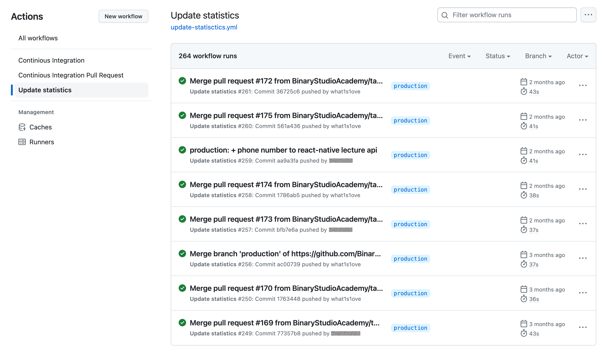

Vladyslav, as Delivery Head of Binary Studio Academy, shares the success story of adopting GitHub for streamlined delivery processes. GitHub's versatility, featuring version control and efficient task management, significantly enhances workflow at the Academy. The narrative concludes with satisfaction over the positive outcomes of GitHub adoption, showcasing its impact on participant experiences at Binary Studio Academy.

---

Hello everyone! I am Vladyslav. At the beginning of 2022, I was offered the role of Delivery Head of BSA (Binary Studio Academy). [Binary Studio Academy](https://academy.binary-studio.com/) is a free, international course that transforms people with basic programming language knowledge into _true_ beginner engineers.

From a delivery perspective, each Academy consists of several specific stages, each of which comprises a varying number of checklists that need to be completed for the stage to be considered successfully completed. Additionally, the Academy involves a substantial amount of documentation for various roles within it, as well as a wealth of content ranging from concise lecture summaries to automated tests that assess homework completion of these lectures.

Despite having two years of experience within the Academy at the time I received this role, I still felt the need for more examples and checklists for all the actions I needed to take at each stage of the Academy. Documentation was not always helpful because we all know that documentation has a tendency to become outdated or get lost when stored in different places. Establishing a process where everyone understands what they need to do, having a single source of truth, and maintaining a history of past Academies became my top priority for change.

## How It Was

Before diving into the current process we use, I would like to start with what we had before. We had a significant number of tools at our disposal. Here are the key ones:

- **[Trello](https://trello.com/)**. Was our tool for managing task boards. Depending on who held the position of Delivery Head of BSA, boards were created by different individuals, sometimes not even within the organization but on personal accounts. This led to the problem that there was no real history of the boards. As a result, for almost every Academy, we had to recall the number of tasks that needed to be completed at each stage. While everyone usually understood what needed to be done, without a clear list of tasks, things were occasionally forgotten.

  

- [**Google Docs**](https://www.google.com/docs/about/). This tool was used both for storing general information, such as documentation and lecture content, and for collecting information required for each Academy. Despite using [Google Drive](https://www.google.com/drive/) and keeping most of the information in one place, there was still a situation where some documents in each Academy were created on the fly to test something or provide a rough draft, and eventually, those documents could become quite valuable. Sometimes, these documents were created not in the BSA Google Drive but in someone's personal account which led to the occasional loss of such documents.

  

- [**Google Sheets**](https://www.google.com/sheets/about/). They were mainly used for collecting statistics but created similar issues as Google Docs, with documents sometimes being scattered across different accounts and losing some degree of organization and accessibility.

  While Google Docs/Sheets in combination with Google Drive are decent tools for storing information in one place, their functionality sometimes fell short of providing convenient management. For example, the process of reviewing changes, especially when it involves multiple people, could become increasingly challenging. The more individuals were involved in working on a single document, the harder it was to control the process.

  Another significant problem was related to document version history. Sometimes it was easier to create a new document than to maintain it for each Academy. As a result, the appearance of certain stages or lectures as they were in the past often got lost. Occasionally, it was crucial to view how certain documents looked in their previous states.

  Another challenge for us was that while all the content was stored in Google Docs, it was often written using [Markdown](https://www.markdownguide.org/). Although Google Docs has [partial support for Markdown](https://support.google.com/docs/answer/12014036), it was insufficient for our needs, and we had to store raw Markdown in Google Docs. This experience was not the most pleasant because things often broke or did not display as intended due to a lack of full Markdown support.

  

We also had other tools in use, such as [Miro](https://miro.com/). This tool was primarily used for visualizing certain process flows, like document change approval processes. Or at some point, we considered using boards in [Asana](asana.com) because non-delivery processes were managed in that tool. However, when we contemplated the move to Asana, I decided to explore other potential tools. After reading many articles and conducting some research, especially on emerging tools, my attention turned to something unusual.

## How It Is Now

I did not have the goal of using just one tool, although that is usually the most convenient option. Providing access to a single tool is much easier than granting access to multiple tools, especially given the volume of people involved in each Academy. Reflecting on what tool we could use to cover all our needs and after reading many articles about the experiences of other products, I chose [GitHub](https://github.com/). It seemed ideal to me in terms of what it could offer us – version history, boards, and a clear process for accepting changes.

A significant factor in my decision was observing GitHub's development over the past six months. I was confident that while not all the features GitHub offered looked perfect at the time, the GitHub team would continue to refine and improve them. Roadmaps of GitHub features, such as the [GitHub Actions Roadmap](https://github.com/orgs/github/projects/4247), were helpful to me. I am a fan of [GitHub Actions](https://docs.github.com/en/actions/learn-github-actions/understanding-github-actions) and enjoy keeping an eye on what is coming soon. Some other GitHub features, like [GitHub Projects](https://docs.github.com/en/issues/planning-and-tracking-with-projects/learning-about-projects/about-projects), also have [open roadmaps](https://github.com/orgs/github/projects/4247) that provide insights into upcoming updates in those features.

Now, let's discuss the core functionality of GitHub that we use for managing delivery processes in the Academy.

- [**Git**](https://docs.github.com/en/get-started/using-git/about-git). Since GitHub is primarily about version control, we immediately resolved the issue of any file getting lost. Additionally, we now have a clear version history for every file, easily accessible through the familiar to all GitHub interface.

  

  Certainly, version history is not the only advantage of Git. In general, it provides a robust toolkit that we make use of. For instance, the ability to quickly revert to a specific version or the conflict resolution functionality when someone starts editing the same file are valuable features. GitHub, in combination with Git, has proven to be a highly convenient tool for managing textual content.

- [**Markdown**](https://www.markdownguide.org/). Since a substantial portion of the content we use in the Academy is written with Markdown syntax, we no longer needed to come up with various workarounds as we did when using Google Docs. Finally, we were able to use `.md` files, which are the standard format for Markdown syntax. We no longer had to worry about the output of information for students being different from what we could see in Google Docs because all the content was stored in files with the appropriate extension.

- [**Issues**](https://docs.github.com/en/issues/tracking-your-work-with-issues/about-issues) & [**Projects**](https://docs.github.com/en/issues/planning-and-tracking-with-projects/learning-about-projects/about-projects). We started using GitHub Projects as our primary board for each Academy. GitHub Projects are closely tied to GitHub Issues, which serve as tasks on the board. In addition, GitHub Projects itself offers a lot of useful functionality, such as various views and filters that allow you to easily and conveniently display information based on your specific criteria.

  

  To be honest, when we first started using GitHub Projects as our main board, not everyone, including myself, was initially thrilled about it. At the outset, we missed some convenient features that Trello offered, such as due dates or easy Slack notification setup for board actions. This was during our first Academy where we began using GitHub as our primary tool for managing delivery processes in the Academy. Since then, GitHub has created a lot of useful documentation, such as how to add automation with GitHub Actions, and they have also introduced many new features, like [custom fields](https://docs.github.com/en/issues/planning-and-tracking-with-projects/understanding-fields) for Issues, which can be used in various ways. For instance, we started using them to store due dates. By the time we got to the second Academy where we used GitHub as our primary tool, it covered everything we needed and even more.

  Once again, because GitHub is fundamentally about version control, GitHub Projects had a simple but crucial feature for us – project archiving. It might seem like a small detail, but the issue of losing boards, which we experienced when using Trello, could be critically important at times. Storing everything within a single GitHub repository, from boards to content, minimized the risk of losing anything.

  

  All our checklists migrated into Issues. With all the statistical highlights, including how much is left to complete an issue and quick navigation to the relevant lectures and [pull requests](https://docs.github.com/en/pull-requests/collaborating-with-pull-requests/proposing-changes-to-your-work-with-pull-requests/creating-a-pull-request), Issues seemed much more convenient than what tickets in Trello offered. Primarily, this was because we used two separate tools, Trello for tickets and Google Docs/Sheets for content. These two tools did not integrate seamlessly, and each time, we had to set up convenient interactions between them for every ticket.

  

  Since Issues are also about clear communication, we agreed with the team that a significant portion of Academy-related communication would take place within Issues. This was primarily for historical purposes, but also because using Issues for this purpose proved to be very convenient. Any internal references, such as to pull requests, were transformed by GitHub into concise text. Additionally, it linked Issues and Pull Requests, making the history of changes and decision-making clearer and more aesthetically pleasing than ever before.

  

- [**Issues Templates**](https://docs.github.com/en/communities/using-templates-to-encourage-useful-issues-and-pull-requests/about-issue-and-pull-request-templates). To standardize all the issues and never forget the checklists that needed to be completed in them, we made use of the Issues Templates feature. One significant advantage is that an issues template is just a text file, like all other files in the repository. This means it benefits from all the powerful functionality of Git, has its own version history, and in case of any issues, you can easily revert it to a specific version.

  

- [**Pull Requests**](https://docs.github.com/en/pull-requests/collaborating-with-pull-requests/proposing-changes-to-your-work-with-pull-requests/creating-a-pull-request). With Google Docs/Sheets, the process of accepting changes to existing lecture content and documentation, as well as creating new documents, was not particularly convenient. The main inconvenience was assigning permissions to users. Since lecture and content owners changed quite frequently in our Academy, keeping track of it all was challenging. It was especially tricky when the change process depended on multiple people. Unfortunately, Google Docs/Sheets did not offer a convenient way to implement a change approval workflow for such cases.

  The familiar process of proposing changes through pull requests was well-received by the entire team. No one needed extensive explanations about how it works because everyone had experience with it. Configuring content ownership through [code owners](https://docs.github.com/en/repositories/managing-your-repositorys-settings-and-features/customizing-your-repository/about-code-owners) resolved the issue of content authorship and whose approvals were needed to get changes into the Academy.

  

  

- [**GitHub Actions**](https://docs.github.com/en/actions). At some point, we realized the importance of automation. We started with linters that run on every pull request. Our linters help us maintain a consistent style throughout all our content and serve as the first line of defense that everyone must pass through when they want to introduce changes to the Academy.

  Here is a list of our main linters:

  - [**remark**](https://remark.js.org/). Primarily, this is a linter for Markdown. Additionally, thanks to its numerous plugins, it allows us to perform additional checks for grammatical mistakes within the content itself. Before using this linter, our content was not scrutinized to this extent.

  - [**prettier**](https://prettier.io/). A code formatter and linter for code formatting. It ensures that all our files have a consistent appearance.

  - [**ls-lint**](https://ls-lint.org/). A linter for file and folder names. Again, we aim for uniformity in this aspect as well.

  - [**editorconfigchecker**](https://github.com/editorconfig-checker/editorconfig-checker.javascript). A linter that checks files for compliance with [editorconfig](https://editorconfig.org/) rules. Another linter that helps maintain consistency in the format of all files.

  - [**commitlint**](https://commitlint.js.org/) & [**dangerjs**](https://danger.systems/js/). Linters that help maintain consistency in all user-provided information related to Git and GitHub (commits, branch names, PR titles, etc.).

  

  Since we aimed to reduce our reliance on Google Docs/Sheets wherever possible, especially in cases where we could extract information from existing data instead of conducting manual audits of lectures in Google Sheets for each Academy, we decided to write a script that automatically compiles statistics based on the information already present in the repository. This script was connected to an GitHub Actions that triggers and updates the statistics every time new changes are pushed to the main branch.

  

  

- [**Teams**](https://docs.github.com/en/organizations/organizing-members-into-teams/about-teams). GitHub has an excellent system of teams and permissions that continues to evolve. The most convenient thing is that by adding an Academy participant to one of the teams, the participant automatically gained access to all the necessary repositories and Projects, of which we have quite a few, while only having the permissions they needed.

  Since some of our content, such as starters for lecture homework or lecture auto-checks, was already in GitHub repositories, setting up teams and permissions took minimal time because we essentially had everything ready prior to the creation of the Academy delivery process management repository.

  

  The list above only enumerates the main features we use to manage our delivery processes at the Academy. I may have missed some aspects because some of these features have become so familiar that it is sometimes hard to remember how we managed processes without them in the past.

## GitHub Gets Better

To be honest, I wanted to write this article after the first Academy when we started actively using GitHub as the primary tool for managing the delivery processes of the Academy. However, I kept delaying it for various reasons. One of the reasons was that I was not entirely satisfied with how we worked around some limitations that existed at the time. For example, as mentioned earlier, we now use [custom fields](https://docs.github.com/en/issues/planning-and-tracking-with-projects/understanding-fields) for setting due dates in issues. Before this feature, we had to set due dates directly in the issue body. While this approach worked, it did not look as elegant as due dates in Trello. Nevertheless, even with these workarounds for limitations at the time, we still liked GitHub better. Moreover, we knew that these limitations would soon be addressed, and GitHub with all its features, would become even better. Currently, we do not feel like we are missing anything from the old set of tools we used.

GitHub is constantly evolving, and one of the recent innovations we want to try in the next Academy is called "[Project Templates](https://docs.github.com/en/issues/planning-and-tracking-with-projects/managing-your-project/managing-project-templates-in-your-organization)". I think the name itself makes it clear what this feature entails. Currently, for each Academy, we need to create a specific set of issues that always repeats. While we never lose the content of these issues because we use [issue templates](https://docs.github.com/en/communities/using-templates-to-encourage-useful-issues-and-pull-requests/about-issue-and-pull-request-templates), it is still repetitive work that needs to be done for every Academy. No one likes to do the same thing over and over again, and project templates were created precisely to automate this task.

The project templates feature is just one example. As mentioned earlier, because GitHub develops features using an open-source development approach, anyone interested can keep track of upcoming feature updates.

## Conclusions

GitHub has long ceased to be a tool exclusively for developers. All the toolsets that appear in GitHub allow it to be used for more than just storing code history. Different companies find various uses for it. From managing an open-source blog to hosting a podcast website (by the way, they store all their recordings in repositories).

Some readers might suggest that similar behavior could be achieved by continuing to use Trello and Google Docs/Sheets while adding stricter requirements and constraints. I partly agree with that, but that approach did not work for us. It is precisely because everything in GitHub is integrated, interconnected, and complements each other seamlessly that there's no desire to create anything on a personal account, as was the case with our old tools. Not to mention the additional automation, from grammar mistakes linting to automatic statistics generation, that GitHub provides.

Undoubtedly, we are pleased with the fact that we now manage our delivery processes in GitHub, and the statistics we collect from people participating in the Academy are a testament to its effectiveness.

<figure>
	
	<figcaption>Before GitHub became our main tool.</figcaption>
</figure>

<figure>
	
	<figcaption>After GitHub became our main tool.</figcaption>
</figure>

While we have not completely eliminated Google Docs/Sheets (although we now use [Notion](https://www.notion.so/) more for this purpose. Yes-yes, one more tool…), it's often easier to quickly create a new MVP for statistics in Google Sheets than to immediately start implementing some logic in GitHub. However, we aim to keep all the essential functionality within GitHub, which serves as the primary tool for controlling all of the Academy's delivery processes.

Coming into the role of Delivery Head of BSA, I was not tasked with establishing a process where every participant understood what they needed to do. While I did not have an exact checklist at that time outlining what each participant should do at each stage, I believe that after 1-2 Academies, I would have formed a similar checklist for myself, and I would have felt confident. The problem is that most likely, I would have been the only one that felt confident with this process. Perhaps for the next people who will support the Academy afterward, it would still not be entirely clear, just as it was for me in the beginning.

Quoting the words of Jimmy Carter, the 39th president of the USA, from my favorite movie "[Miracle](<https://en.wikipedia.org/wiki/Miracle_(2004_film)>)": "_We've always had a faith that the days of our children would be better than our own_", by introducing tools like GitHub and all the other innovations into the Academy, which I have implemented and continue to implement, I wanted to facilitate the experience of participating in the Academy for both the current generation and all those who come after us.

<figure>
	
	<figcaption>What the ideal end of the Academy looks like to me.</figcaption>
</figure>
