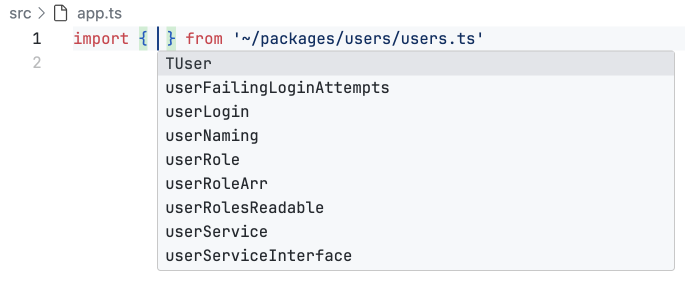
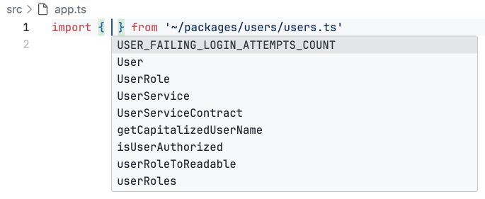

It is no secret that developers have to ponder over numerous everyday tasks. Part of their thoughts is always dedicated to various routine matters, such as "In which module should I place this function?", "_How should I name this variable?_", or "What should this variable do?". Despite these questions appearing simple and trivial, they consistently consume mental resources. However, if there are ways to simplify this process by automating some routine tasks, thereby focusing attention on more critical matters, it undoubtedly makes sense to take advantage of them.

In this context, naming conventions play a crucial role. Acquiring knowledge and employing these conventions judiciously contribute to enhanced code readability, simplifying comprehension, and reducing the developer's cognitive load. However, not all developers are aware of, and sometimes forget, how to correctly apply these conventions, mindlessly diverting their attention to seemingly more critical matters. This, in turn, complicates the readability and understanding of their code, making ostensibly "more critical" tasks more intricate than they could actually be.

Below is a screenshot from a real project I had the opportunity to work on. Take note of each import. Try to _guess_, based on the names, what item we can obtain from each of the imports.



In this article, we will explore most of them, learning or reminding ourselves which principles are best to follow when choosing names for the constructs you write. This will help both you and anyone who works with your code in the future – whether it is your team or _yourself_ after some time – avoid _guesswork_ and enhance the readability of your code.

## JavaScript Naming Conventions

This article will consist of a set of naming recommendations. I would not want you to perceive them as the sole truth. Firstly, it is not entirely the case, as most recommendations come with a disclaimer that there are numerous exceptions, hinting that the conventions themselves do not cover all cases. Secondly, while most recommendations are accepted in the JavaScript community, not everyone follows them for various reasons, and some recommendations are either partially or significantly modified to suit specific teams.

The main message of the article is that each project should establish its naming conventions, whether they align with widely adopted ones or are unique to your team. The crucial aspect is to have conventions and adhere to them.

### General Rules

On the internet, there is a considerable number of articles written about best naming practices. Well-known conventions emphasize that a name should be short and, more importantly, **understandable**. The name should be specific, correspond to the context in which it is used, and convey the meaning of the code at a glance. In reality, these conventions can and should be applied not only when working with JavaScript but also with any programming language. In these general rules, I would like to focus on some specific details in conventions that are widely known but often forgotten or not fully adhered to.

- **Uniformity.** In JavaScript projects, there are numerous conventions, but the most valuable one to adhere to is maintaining a consistent coding style within a single project. Individuals involved in different projects know better than anyone that writing styles can vary significantly between projects.

  Situations often arise where different parts of an application are developed by different teams or use different technologies in their development. Naming conventions may differ based on the chosen programming language or the preferences of the development team. Despite these differences, different parts of the application need to interact with each other, such as data exchange between the frontend and backend. For example, the naming style for data requested from the backend might differ from the style used in the frontend code.

  Despite the convention in the JavaScript language to write in `camelCase`, it is worth noting that nothing is preventing the use of, for instance, `snake_case`. As already mentioned, this notation might be more familiar to many other programming languages and some teams. There might be situations where a naming case different from the style of your application starts creeping into your code.

  It is not our place to judge whether using different naming cases is good or bad, as various reasons may drive such choices. However, explicit mixing of two or more naming cases can pose challenges. For new developers joining the project, understanding what is happening and deciding which naming case to use can become quite challenging.

  <!-- prettier-ignore -->
  ```js
  // Bad
  const hasAccess = checkHasUserAccess(session.current_user) && checkIsPageVisible(session.current_page)

  // Good
  const hasAccess = checkHasUserAccess(session.currentUser) && checkIsPageVisible(session.currentPage)

  // Also good, if such a naming case is preferred
  const has_access = check_has_user_access(session.current_user) && check_is_page_visible(session.current_page)
  ```

  There are several ways to address this issue, ranging from using renaming with [destructuring](https://developer.mozilla.org/en-US/docs/Web/JavaScript/Reference/Operators/Destructuring_assignment), [import renaming](https://developer.mozilla.org/en-US/docs/Web/JavaScript/Reference/Statements/import), using mapping functions (e.g., [Array.prototype.map()](https://developer.mozilla.org/en-US/docs/Web/JavaScript/Reference/Global_Objects/Array/map)), and more advanced approaches like utilizing the [Adapter](https://refactoring.guru/design-patterns/adapter) design pattern.

  The key is to adopt a consistent approach, not only in naming conventions but also in how tasks are accomplished. Whenever possible, prefer a single method for a particular action. Avoid forcing yourself and other developers to spend time and extra mental resources deciding which approach to use. Consider delegating such tasks, especially those related to coding style, to tools like [ESLint](https://eslint.org/).

- **English only**. Despite the fact that you can use non-Latin letters when writing in JavaScript, it is not recommended to do so. While there will not be any programming errors, it is strongly discouraged to use any languages other than English. Even if you are writing something for yourself, every piece of code has the ability to "live long", and there may come a time when you need to share this code with other developers. For other developers, especially from different countries, it will be difficult to understand what is happening in the code.

  When emphasizing the use of only English, people often think only about keyboard layout. However, one should not forget about abbreviations and the general use of short forms for names. They should only be used with commonly accepted words, such as `idx`, `err`, `evt`, `xhr`, `src`, and other historically accepted words in the community. In other cases, the use of abbreviations and short forms of words is strongly discouraged, as they often lead to confusion, and deciphering them can take a lot of time.

  ```js
  // Bad
  const 新規ユーザーのウェルカムメッセージ = 'こんにちは'

  const usrInf = { fName: 'John', lName: 'Doe' }

  const isAdult = a >= 18

  // Good
  const newUserWelcomeMessage = 'こんにちは'

  const userInfo = { firstName: 'John', lastName: 'Doe' }

  const isAdult = userAge >= 18
  ```

  It is also recommended to enable a spell checker in your code editor, which will highlight grammatical errors in words. In many editors it is enabled by default, and for some you may need to install an extension, such as [Code Spell Checker](https://marketplace.visualstudio.com/items?itemName=streetsidesoftware.code-spell-checker) for VS Code. Today's spell checkers are smart enough, and most commonly accepted abbreviations and short forms of words will not be flagged as errors.

- **Not only `camelCase`**. Many resources emphasize using `camelCase` notation _exclusively_ when writing in JavaScript. However, this is not entirely accurate. The recommendation is more about **adhering to the notation used by the language itself**. While a _significant_ portion of the JavaScript language is written in `camelCase`, it is not universally so. Here are a few examples:

  <!-- prettier-ignore -->
  ```js
  parseInt('18') // camelCase

  new RegExp('[A-Z]', 'i') // PascalCase

  Number.EPSILON // PascalCase + UPPER_SNAKE_CASE

  NodeFilter.SHOW_COMMENT //
  NodeFilter.SHOW_ENTITY  // PascalCase + set of UPPER_SNAKE_CASE
  NodeFilter.SHOW_ELEMENT //
  ```

  As we can see, JavaScript incorporates not only `camelCase` notation but also some others. All classes and constructor functions in JavaScript are written using `PascalCase` notation. When declaring custom classes and constructor functions, it is customary to follow the same naming convention as the language itself. The same applies to constants, representing fixed values. Both built-in JavaScript constants and those created by developers are conventionally named in `UPPER_SNAKE_CASE`. Enums, sets of constants, are also present in JavaScript, especially in closely related JavaScript APIs such as the DOM API and others. Enums are usually named in `CamelCase`, while all their keys are written using `UPPER_SNAKE_CASE`.

  In contrast to some programming languages where the API is written using various cases without clear distribution, JavaScript's API does not suffer from this issue. Therefore, it is customary to adhere to the conventions present in the language itself.

- **Follow `readme.md`**. Suppose you are working with a network request library like [axios](https://www.npmjs.com/package/axios), and the library's README recommends using the standard name `axios` for imports.

  ```js
  import httpRequester from 'npm:axios'

  // Somewhere very far at the bottom of the file

  httpRequester('https://example.com')
  ```

  Changing the name from `axios` to `httpRequester` can cause confusion and errors, as other developers working on the project and expecting the standard name `axios` may encounter issues. Therefore, it is important to adhere to the recommendations set in the library's README to ensure compatibility and code understanding.

  At first glance, the example with the `axios` library may seem harmless, but similar renaming scenarios can arise with the use of more complex libraries and frameworks deeply integrated into a project. Teams that adopt _meaningful_ renaming practices will need to create their own documentation because new team members will not find sufficient information in the official documentation to understand the changes in the technology's usage style.

  Typically, _meaningful_ renaming into something more abstract, is used in conjunction with the [dependency inversion principle](https://en.wikipedia.org/wiki/Dependency_inversion_principle). However, it is important to understand the fine line here. You and your team must have a clear understanding of what you are doing and why, as there needs to be a balance in adopting such practices.

- **No data types**. It can be tempting to include data types in variable names, but succumbing to this temptation often adds unnecessary semantic load to the name. For instance, using the name `arr` for a variable containing an array can lead to conflicts if a variable with the same name is used elsewhere. Moreover, the name `arr` does not convey meaningful information. Making the name more specific, like `userArr`, is an improvement, but it does not address all the issues.

  ```js
  // Bad
  const userNameMinLengthConst = 3

  const userObj = getUser()

  const getUniqueUserNames = (arr) => Array.from(new Set(arr))

  // Good
  const USER_NAME_MIN_LENGTH_COUNT = 3

  const user = getUser()

  const getUniqueUserNames = (names) => Array.from(new Set(names))
  ```

  For each language construct, whether built-in or custom data structures, there exists a conventional way to indicate the intended data type of the value. This is reflected in the name of the construct, which should align with both the established community conventions and those within your team. It is advisable to prioritize community conventions, as explaining something widely accepted is generally easier than introducing something entirely unique. In the case of community conventions, you can refer someone to an internet article, while for team-specific conventions, you might need to write that article yourself.

### Specific Rules

In this section, we will discuss specific naming conventions for data types and data structures. While JavaScript may appear limited in its built-in data types and structures, it offers extensive capabilities. These encompass a variety of methods, which in other programming languages are often segregated into distinct built-in types or data structures.

For instance, in JavaScript, an object can serve as an `enum`, `map` (`dictionary`), `graph`, and more. The `number` data type in JavaScript includes handling both integers and floating-point numbers. Depending on specific requirements, JavaScript data types and structures can be flexibly adapted for use, providing JavaScript with versatility and power.

It is in this context that the importance of naming conventions becomes clear. They not only enhance code readability but also prevent confusion and errors when interacting with other parts of the codebase. Good naming conventions ensure clarity within the code and facilitate understanding of data structures and their purposes for other developers, contributing to more effective collaboration within a team.

- **Booleans**. Names of boolean values should start with an affirmative prefix, meaning the prefix should answer the question "yes." Although there are several affirmative words (should, can, will, etc.) that answer "yes," it is advisable to prefer the two most common ones – `is` and `has`. While using other affirmative words will not be considered an error, their use should be treated as an exception, and if possible, it is better to avoid using them.

  An important addition to this convention, often overlooked, is that the affirmative prefix should not include a negation. The reason behind this is that the negation operator (`!`) is most commonly used with boolean values. Therefore, a value named something like `isNotAllowed` with the negation applied to it `!isNotAllowed` can be quite misleading. Do not believe so? Then try quickly figuring out what `!!isNotAllowed` (double negation) equals. Even if you manage to do it quickly, imagine working with real code where all these negation inversions are scattered throughout the file. Keeping track of such logic, especially when there is a lot of it, can be quite challenging. In such cases, it is better to alter the logic of evaluating the boolean variable using a positive affirmative in its name.

  <!-- prettier-ignore -->
  ```js
  // Bad
  const userLogin = user !== null

  const user = {
    friend: false,
  }

  const isNotUserRemoved = userActionState !== ActionState.REMOVED
  if (isNotUserRemoved) { /* some logic */ }

  // Good
  const isUserAuthorized = user !== null
  const hasUser = user !== null

  const user = {
    hasFriend: false,
  }

  const isUserRemoved = userActionState === ActionState.REMOVED
  if (!isUserRemoved) { /* some logic */ }
  ```

  Along with the convention to use affirmative prefixes for boolean names, we diverge from the [W3C specification recommendations](https://w3ctag.github.io/design-principles/#naming-booleans), as it advises against using these prefixes for boolean names. This contradicts the idea mentioned earlier to prefer conventions used by the language itself. However, there are always exceptions, and this is one of them. It is normal since the way specification authors think may differ from the community's perspective.

  JavaScript was created a long time ago, and at the time of its inception, the authors decided not to use affirmative prefixes for boolean names. Now, they do their best by [continuing to follow](https://github.com/tc39/proposal-decorators/issues/417) their convention, even if it goes against the community's opinion. Even if the authors wanted to introduce new naming conventions in the specification, they could not do it, at least not coherently. Old code cannot be renamed because JavaScript must remain backward-compatible. And starting to write new code using new approaches is not a great idea either, as there would be two ways to do the same thing, which is also undesirable.

  Exceptions are normal. Nothing in this world is perfect. Even the specification itself has exceptions – [`node.isContentEditable`](https://developer.mozilla.org/en-US/docs/Web/API/HTMLElement/isContentEditable) or [`evt.isTrusted`](https://developer.mozilla.org/en-US/docs/Web/API/Event/isTrusted). The key is to try to minimize them while adhering to previously established conventions.

- **Functions & Methods**. The name of a function/method should be a verb and correspond to the action it performs.

  <!-- prettier-ignore -->
  ```js
  // Bad
  const userNaming = (name) => name.charAt(0).toUpperCase() + name.slice(1)

  const user = {
    name: 'John',
    action() {
      console.log('Hey')
    },
  }

  const userPermissions = (userId) => permissionRepository.getByUserId(userId)

  // Good
  const getCapitalizedUserName = (name) => name.charAt(0).toUpperCase() + name.slice(1)

  const user = {
    name: 'John',
    sayHello() {
      console.log('Hey')
    },
  }

  const getUserPermissions = (userId) => permissionRepository.getByUserId(userId)
  ```

  Although the naming convention for functions/methods may seem simple at first glance, their naming is the one that has the most exceptions and other conventions.

  - Following the JavaScript writing style (`Number.isNaN()`, `Array.isArray()`, `salary.toFixed()`, [constructor functions](https://developer.mozilla.org/en-US/docs/Web/JavaScript/Reference/Operators/new), etc.).

  - Naming conventions for event handler functions (`onBtnClick`, `onImgMouseOver`, etc.).

  - Library functions, for example, a reducer function in the [Redux](https://redux.js.org/) library (`const users = (state, action) => { /* some logic */ }`), functional components in [React](https://react.dev/) (`const UserDashboard = () => { /* component */ }`), and many other exceptions and conventions proposed by libraries and frameworks.

  You can learn about all of them by working directly with them. However, for most functions and methods, the main convention that the name should be a verb and correspond to the action they perform remains unchanged.

- **Collections & Iterators**. The naming convention is as follows – if [Iterator](https://developer.mozilla.org/en-US/docs/Web/JavaScript/Reference/Global_Objects/Iterator) or [indexed collections](https://developer.mozilla.org/en-US/docs/Web/JavaScript/Guide/Indexed_collections) (e.g., `Array`, `NodeList`, `FileList`, etc.) are used, the name should be a plural noun. Otherwise, if [keyed collections](https://developer.mozilla.org/en-US/docs/Web/JavaScript/Guide/Keyed_collections) (`Set`, `Map`) are used, and we are only interested in _values_ that we can obtain by keys (usually using `Array.from()` or [spread syntax](https://developer.mozilla.org/en-US/docs/Web/JavaScript/Reference/Operators/Spread_syntax)), the naming convention remains the same – the name should be a plural noun. However, if the keys are also important to us in keyed collections, then such collections should be named using a singular noun, and at the end of the name, add one of the prefixes that signifies a set of something. For example, `Collection`, `List`, `Group`, and others.

  An important addition is that this convention should also be applied to user-created indexed or keyed collections using [Iteration protocols](https://developer.mozilla.org/en-US/docs/Web/JavaScript/Reference/Iteration_protocols).

  <!-- prettier-ignore -->
  ```js
  // Bad
  const userRoleArr = Object.values(UserRole)

  const usersAccordionList = document.querySelectorAll('.users-accordion__list-item')

  const groupPermissions = new Map(Object.entries(Object.groupBy(permissions, (permission) => permission.group)))

  // Good
  const userRoles = Object.values(UserRole)

  const usersAccordionItemNodes = document.querySelectorAll('.users-accordion__list-item')

  const permissionsByGroupList = new Map(Object.entries(Object.groupBy(permissions, (permission) => permission.group)))
  ```

- **Classes**. When working with classes, it is important to follow several conventions. Here is the list:

  - Use `PascalCase` for the class name, following the same case style that JavaScript uses for classes and constructor functions.

  - The class name should be a singular noun.

  - Names of all class members should not include the class name.

  ```js
  // Bad
  class userService {
    /* class members */
  }

  class Permissions {
    /* class members */
  }

  class UserAuthPopup {
    isPopupOpen = false

    openPopup() {
      this.isPopupOpen = true
    }
  }

  // Good
  class UserService {
    /* class members */
  }

  class PermissionService {
    /* class mmebers */
  }

  class UserAuthPopup {
    isOpen = false

    open() {
      this.isOpen = true
    }
  }
  ```

  If there is a temptation to use the class name in the names of its members, it is likely that the class is overloaded with logic or is responsible for more things than it should be. In such cases, a violation of the [Single Responsibility Principle](https://en.wikipedia.org/wiki/Single-responsibility_principle) can often be observed. To avoid such situations, it is recommended to create additional classes and use inheritance or dependency injection to limit the responsibility of each class.

- **Constants**. Used to describe values which are known _before the program's execution_ and that _should not change_ during its execution.

  Constants are a crucial and widely adopted approach to organizing a program's code. Regarding naming conventions, there is an important agreement among developers: the name of a constant should be written using the `UPPER_SNAKE_CASE` notation.

  ```js
  // Bad
  const userFailingLoginAttempts = 3

  const USER_ROLE = calculateUserRole(user)

  let userDefaultAuthMethod = 'mfa'

  // Good
  const USER_FAILING_LOGIN_ATTEMPTS_COUNT = 3

  const userRole = calculateUserRole(user)

  let USER_DEFAULT_AUTH_METHOD = 'mfa'
  ```

  Although there are several ways to declare a variable in JavaScript, and for constants, it might seem logical to use _only_ the `const` keyword, which _[prevents it from being changed](https://developer.mozilla.org/en-US/docs/Web/JavaScript/Reference/Statements/const#description)_ during program execution, as some teams prefer not to worry about choosing the keyword for variable declarations. They may use automation tools like [ESLint](https://eslint.org/) to enforce the use of only the `let` keyword for variable declarations in the program code.

  Again, every team is different, and each may have its own conventions. However, even the prohibition of using seemingly more appropriate constructs and keywords is not an indicator of how something should be done or named. Naming always carries more meaning than the use of any keywords. This is why naming is such a crucial aspect of code writing.

- **Enums**. Also known as enumerations. In JavaScript, this _data structure_ is used to enumerate a set of fixed values.

  Unlike many other programming languages that have a separate data type for enumerations, JavaScript does not have such a data type (at least, as of now). Instead, to simulate an enumeration in JavaScript, a plain object can be used, but with specific naming conventions. Here is a list of these naming conventions:

  - The name of the enumeration should start with a capital letter.

  - The name of the enumeration should be in the singular noun.

  - The keys of the enumeration should be in uppercase.

  ```js
  // Bad
  const userRole = {
    admin: 'admin',
    guest: 'guest',
  }

  const USER_API_PATHS = {
    root: '/',
    users$Id: '/users/:id',
  }

  const userValidationRules = {
    MIN_PASSWORD_LENGTH: 8,
    MAX_NAME_LENGTH: 20,
    VALID_REFERRER_DOMAINS: ['google.com'],
  }

  // Good
  const UserRole = {
    ADMIN: 'admin',
    GUEST: 'guest',
  }

  const UserApiPath = {
    ROOT: '/',
    USERS_$ID: '/users/:id',
  }

  const UserValidationRule = {
    MIN_PASSWORD_LENGTH: 8,
    MAX_NAME_LENGTH: 20,
    VALID_REFERRER_DOMAINS: ['google.com'],
  }
  ```

  Since TypeScript is now a significant part of JavaScript development, it is worth mentioning that TypeScript has the `enum` keyword for enumerations. If you decide to use TypeScript's enumerations with your team, it is customary to follow the same naming conventions.

- **Maps**. Also known as a `dictionary` data structure. This data structure is used for _mapping_ one value to another.

  A map is a very useful and frequently used data structure in any programming language. For maps in the JavaScript world, there is a specific naming convention. The name should follow the pattern `aToB`, where `a` serves as the key for retrieving values from the map, followed by the preposition `To`, implying the mapping of two things, and then `B`, which is the mapped value for `a`.

  ```js
  // Bad
  const userRolesReadable = {
    [UserRole.ADMIN]: 'Administrator',
    [UserRole.GUEST]: 'Guest',
  }

  const REDIRECTING = {
    '/groups': '/admin-login',
    '/profile': '/login',
  }

  const UserPermissions = {
    [UserRole.ADMIN]: [Permission.MANAGE_USERS, Permission.MANAGE_GROUPS],
    [UserRole.GUEST]: [Permission.EDIT_PROFILE],
  }

  // Good
  const userRoleToReadable = {
    [UserRole.ADMIN]: 'Administrator',
    [UserRole.GUEST]: 'Guest',
  }

  const pagePathToRedirectPath = {
    '/groups': '/admin-login',
    '/profile': '/login',
  }

  const userRoleToPermissions = {
    [UserRole.ADMIN]: [Permission.MANAGE_USERS, Permission.MANAGE_GROUPS],
    [UserRole.GUEST]: [Permission.EDIT_PROFILE],
  }
  ```

  There is a built-in [`Map`](https://developer.mozilla.org/en-US/docs/Web/JavaScript/Reference/Global_Objects/Map) class in JavaScript. The main difference from a regular object is the ability to use any data type (even an object) as a key. Usually, using the native `Map` class is redundant for creating a map as a data structure. However, if you need the functionality provided by the native `Map`, you can use it to create a map data structure. In most cases, a regular object will suffice.

- **Types & Interfaces**. As mentioned earlier, TypeScript has become an integral part of JavaScript development today. In general, _in most cases_, types and interfaces are interchangeable. However, since there are already enough discussions about which one to choose, in this article, we will focus specifically on naming. For types and interfaces, the following naming conventions exist:

  - Names of types and interfaces should be written in `PascalCase` notation.

  - The name should describe what the type or interface will be used for, often as straightforwardly as possible: `const user: User = getUserById(id)` / `const users: User[] = getUsers()`.

  - If a development team has decided to _actively_ use both types and interfaces in one codebase, it is recommended to add a prefix to interfaces to distinguish them. The most popular prefixes are `I` and `Contract`.

  ```ts
  // Bad
  type TUser = {
    firstName: string
    lastName: string
  }

  interface user {
    firstName: string
    lastName: string
  }

  interface userServiceInterface {
    findByEmail: (email: string) => User
  }

  // Good
  type User = {
    firstName: string
    lastName: string
  }

  interface User {
    firstName: string
    lastName: string
  }

  interface UserServiceContract {
    findByEmail: (email: string) => User
  }
  interface IUserService {
    findByEmail: (email: string) => User
  }
  ```

It is important to realize that despite the extensive overview of JavaScript naming conventions in this article, it cannot cover all possible scenarios. Even within the presented points, numerous exceptions should be considered. The naming process, although fundamental, implies flexibility in application, taking into account the unique features and requirements of each project.

## Conclusion

During development, we often delve into complex technical details, forgetting that the power often lies in the details. Years of development experience only affirm the truth that attention to details, such as naming, plays a crucial role in creating efficient and readable code. Simplicity and the absence of the need to ponder over how to name a value and how quickly to understand what it contains bring incredible relief in the daily work of a developer.

Can a developer consider themselves strong if their variables are not clearly named? Clear naming not only makes the code more understandable for other developers but also for the programmer themselves, making the development process more efficient and less error-prone.

It often happens that searching for poor naming leads to the discovery of bad code. This only underscores how naming conventions serve as an indicator of code quality. Proper naming reflects care for details, which, in turn, speaks to an attentive approach to development.

Here is how the import of values from the introductory part looks when applying the conventions discussed in this article. Now it looks much clearer, doesn't it? I am sure it will take you much less effort now to understand the meaning of each import.



In conclusion, it is essential to remember that while naming standards are important, they are not absolute. Every project has its peculiarities, and it is crucial to define your conventions. The main thing is that they should exist, and you adhere to them to ensure consistency in the code and improve collective productivity. Also, if possible, try to delegate code style issues to tools like [ESLint](https://eslint.org/) to simplify and enhance the development process.
