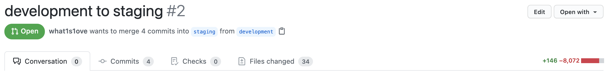

In the fast-paced world of web development, innovation is constant. This article explores Deno, comparing it to Node.js, examining their similarities, differences, and the possibility of Deno replacing Node.js. Let's journey from Node to Deno, embracing change and discovering new possibilities.

Let's start with the riddle, who is shown in this photo? 🙂


Most likely, you have worked with his product. 😉

<details>
	<summary>Answer</summary>

    **[Ryan Dahl](https://en.wikipedia.org/wiki/Ryan_Dahl)** is a software engineer and the original developer of the **`Node.js`** (~2009 year). In January 2012, Dahl announced that he turned over the reins to [NPM](<https://en.wikipedia.org/wiki/Npm_(software)>) creator.

    In 2018 he made a presentation ['10 things I regret about Node.js'](https://www.youtube.com/watch?v=M3BM9TB-8yA&vl=en) at the [JSConf](https://jsconf.com/) conference. Also, at this presentation, he announced [Deno](https://deno.land/) — a secure runtime for JavaScript and TypeScript.

</details>

In this article, we will take a look at `Deno` and how it compares to `Node.js` to help understand what they have in common, how they differ and is it real that `Deno` will kill `Node.js`?

## Project

Let's imagine a situation: A product owner comes to us and tells us to rewrite the project from [Node](https://nodejs.org/) to [Deno](https://deno.land/).

But why? Who knows, it’s just an example. 🙂

For now, let's imagine that there is no other way around this decision and we need to do it. But then what? Do we really need to rewrite most of the code in the project?

Let's check this with an example of a small project.

- **Project structure:**

  ```
  ├── node_modules
  ├── public
  ├── src/
  │   ├── api/
  │   │   ├── /* apis */
  │   │   └── api.ts
  │   ├── common/
  │   │   ├── enums/
  │   │   │   ├── /* enums */
  │   │   │   └── index.ts
  │   │   ├── interfaces/
  │   │   │   ├── /* interfaces */
  │   │   │   └── index.ts
  │   │   └── types/
  │   │       ├── /* types */
  │   │       └── index.ts
  │   ├── helpers/
  │   │   ├── /* helpers */
  │   │   └── index.ts
  │   ├── repositories/
  │   │   ├── /* repositories */
  │   │   └── repositories.ts
  │   ├── services/
  │   │   ├── /* services */
  │   │   └── services.ts
  │   └── server.ts
  ├── .env
  ├── .eslintrc.yml
  ├── package-lock.json
  ├── package-lock.json
  └── tsconfig.json
  ```

- **Dependencies:**

  ```json
  // package.json

  {
    "private": true,
    "scripts": {
      "lint:js": "eslint --ext .js,.ts src",
      "lint": "npm run lint:js",
      "start": "nodemon --exec ts-node --files -r dotenv/config ./src/server.ts"
    },
    "dependencies": {
      "axios": "0.21.1",
      "dotenv": "8.2.0",
      "koa": "2.13.1",
      "koa-bodyparser": "4.3.0",
      "koa-router": "10.0.0",
      "koa-static": "5.0.0"
    },
    "devDependencies": {
      "@types/jest": "26.0.22",
      "@types/koa": "2.13.1",
      "@types/koa-bodyparser": "4.3.0",
      "@types/koa-router": "7.4.2",
      "@types/koa-static": "4.0.1",
      "@types/node": "14.14.41",
      "@typescript-eslint/eslint-plugin": "4.22.0",
      "@typescript-eslint/parser": "4.22.0",
      "eslint": "7.24.0",
      "jest": "26.6.3",
      "nodemon": "2.0.7",
      "prettier": "2.2.1",
      "ts-jest": "26.5.5",
      "ts-node": "9.1.1",
      "typescript": "4.2.4"
    }
  }
  ```

- **Root file:**

  ```js
  // src/server.ts

  import { resolve } from 'path'
  import Koa from 'koa'
  import serve from 'koa-static'
  import Router from 'koa-router'
  import bodyParser from 'koa-bodyparser'
  import { ENV } from './common/enums'
  import { initRepositories } from './repositories/repositories'
  import { initServices } from './services/services'
  import { initApis } from './api/api'

  const app = new Koa()

  app.use(bodyParser())

  const repositories = initRepositories()

  const services = initServices({
    repositories,
  })

  const apiRouter = initApis({
    Router,
    services,
  })

  app.use(apiRouter.routes())

  app.use(serve(resolve(__dirname, '../public')))

  app.listen(ENV.APP.SERVER_PORT)

  console.log(`Listening to connections on port — ${ENV.APP.SERVER_PORT}`)
  ```

Nothing special. The project is written using a node-framework - [Koa](https://koajs.com/) (next generation of the [Express](https://expressjs.com/) node-framework).

What it can do:

- Serve static content

  ```bash
  > curl "<http://localhost:3000>"

  <!DOCTYPE html>
  <html lang="en">
    <head>
      <meta charset="UTF-8" />
      <meta http-equiv="X-UA-Compatible" content="IE=edge" />
      <meta name="viewport" content="width=device-width, initial-scale=1.0" />
      <title>Document</title>
    </head>
    <body>
      <h1>Hello world 😛</h1>
    </body>
  </html>
  ```

- Posts api (wrapper for the [jsonplaceholder](https://jsonplaceholder.typicode.com/) service).

  ```bash
  > curl "<http://localhost:3000/api/v1/posts/1>"

  {"userId":1,"id":1,"title":"sunt aut facere repellat provident occaecati excepturi optio reprehenderit","body":"quia et suscipit\\nsuscipit recusandae consequuntur expedita et cum\\nreprehenderit molestiae ut ut quas totam\\nnostrum rerum est autem sunt rem eveniet architecto"}
  ```

- Books CRUD api (all data is stored in the `json` format).

  ```bash
  > curl "<http://localhost:3000/api/v1/books/1>"

  {"id":"1","name":"DDD"}
  ```

That's all. Perfect!

Let's move on to the most interesting part.

## From Node to Deno

Before we start, let's take a look at the definition of these two technologies that we can find on the technology homepage.

[Node](https://nodejs.org/en) — is a JavaScript runtime.

[Deno](https://deno.land/) — is a secure runtime for JavaScript and TypeScript.

Both definitions contain `runtime` and `JavaScript`. Does it mean that we can run the same code on both platforms? Not at all.

Let's try to run the code that we wrote on NodeJS base using Deno (if you don't have Deno installed yet, you can find how to do it [here](https://deno.land/#installation)):

```bash
> deno run src/server.ts
```

Aaaand we get an error:

```bash
error: Cannot resolve module "file:///src/services/services" from "file:///src/server.ts".
  at file:///src/server.ts:8:0
```

But interestingly, we did not receive an error saying that we use TypeScript code. This is because Deno supports TypeScript out of the box!

If we tried to run code written with TypeScript in NodeJS without using `ts-node` (or any other _additional package_), we would immediately get errors about the unknown syntax.

Okay, let's try to fix the differences between Node and Deno.

First of all, let's install an [official extension](https://marketplace.visualstudio.com/items?itemName=denoland.vscode-deno) to help us develop on Deno and add this to the editor settings:

```json
// .vscode/settings.json

{
  "deno.enable": true,
  "deno.lint": true,
  "deno.unstable": true
}
```

Then, let's remove the things that are completely **useless** for Deno that are in NodeJS.

```bash
> rm -rf node_modules package-lock.json package.json
```

Stop what? Where do we store our packages now?

Do not worry, we will store the dependencies _we need_ here:

```js
// src/dependencies.ts

import '<https://deno.land/x/dotenv/load.ts>'
import * as Oak from '<https://deno.land/x/oak/mod.ts>'

export { Oak }
```

Two questions immediately arise: what is `dependencies.ts` and why do we use a link to import packages?

Let's start from the end. Two reasons that Ryan talked about in his [presentation](https://www.youtube.com/watch?v=M3BM9TB-8yA&t=1369s) and that he tried to fix this in Deno are `node_modules` and `package.json`.

Why:

- `package.json`:
  - Allow Node's `require()` to inspect package.json files for "main";
  - Included NPM in the Node distribution, which much made it the defacto standard;
  - It's unfortunate that there is centralized (privately controlled even) repository for modules;
  - Allowing `package.json` gave rise to the concept of a "module" as a directory of files;
  - This is no a strictly necessary abstraction - and one that doesn't exist on the web;
  - `package.json` now includes all sorts of unnecessary information. License? Repository? Description? It's boilerplate noise;
  - If only relative files and URLs were used when importing, the path defines the version. There is no need to list dependencies.
- `node_modules`:
  - It massively complicates the module resolution algorithm;
  - vendored-by-default has good intentions, but in practice just using `$NODE_PATH` wouldn't have precluded that;
  - Deviates greatly from browser semantics;
  - It's my fault and I'm very sorry;
  - Unfortunately it's impossible to undo now.

(The reasons are taken from Dahl's presentation). When the program is launched for the first time, modules are downloaded and cached in the system. And when reused, they will be taken from there. While reusing modules, they will be taken from the cache.

Now about `dependencies.ts`. It's just a file that I created to store all third-party project's dependencies (the name can be whatever). Third-party modules can be included in any part of the program but this is not a good practice. It is better to keep all the modules in one place.

Let's try to run the code again. We get the following error:

```bash
error: Is a directory (os error 21)
  at file:///src/server.ts:6:0
```

On the sixth line we have this:

```js
// src/server.ts

import { ENV } from './common/enums'

// src/common/enums/index.ts

export * from './api'
export * from './app'
export * from './file'
export * from './http'
```

Everything looks fine. What is the problem?

It would seem that we can miss the file name if the file is called `index`.

This is possible but only in NodeJS. In Deno we must always explicitly specify the file with its extension.

These are two more things Dahl regrets about Node:

- `index.js`:
  - I thought it was cute because there was `index.html`;
  - It needlessly complicated the module loading system;
  - It became especially unnecessary after `require` supported `package.json`.
- modules without the extension:
  - Needlessly less explicit;
  - Not how browser JavaScript works. You cannot omit the `.js` in a script tag src attribute;
  - The module loader has to query the file system at multiple locations trying to guess what the user intended.

Let's fix this and a few other errors that we will run into.

1. Resole magic names

   ```js
   // src/common/enums/index.ts

   export * from './api/index.ts'
   export * from './app/index.ts'
   export * from './file/index.js'
   export * from './http/index.ts'
   ```

2. Resolve magic variables/functions/modules that are only available in Node

   ```diff
   error: Uncaught ReferenceError: __dirname is not defined

   - app.use(serve(resolve(__dirname, '../public')));
   + await Oak.send(ctx, ctx.request.url.pathname, {
   +   root: 'public',
   +   index: 'index.html',
   + });
   ```

   ```diff
   error: Uncaught ReferenceError: require is not defined

   - const contentType = require('./content-type.enum');
   + import contentType from './content-type.enum.ts';

   ```

   ```diff
   error: Uncaught ReferenceError: module is not defined

   - module.exports = {
   + export {
   ```

3. Resolve take variables from env

   ```diff

   // src/common/enums/app/env.enum.ts

   - const { PORT, PLACEHOLDER_API_URL } = process.env;

   const ENV = {
     APP: {
   -    SERVER_PORT: <string>PORT,
   +    SERVER_PORT: Number(Deno.env.get('PORT')),
     },
     API: {
       V1_PATH: '/api/v1',
     },
     API_URL: {
   -    PLACEHOLDER_API: <string>PLACEHOLDER_API_URL,
   +    PLACEHOLDER_API: <string>Deno.env.get('PLACEHOLDER_API_URL'),
     },
   } as const;
   ```

4. Resolve writeFile/readFile helpers

   ```diff

   // src/helpers/fs/read-file/read-file.helper.helper.ts

   - import fs from 'fs/promises';

   - const readFile = (path: string): Promise<Buffer> => {
   -   return fs.readFile(path);
   + const readFile = (path: string): Promise<string> => {
   +   return Deno.readTextFile(path);
   };

   export { readFile };

   // src/helpers/fs/write-file/write-file.helper.helper.ts
   - import fs from 'fs/promises';

   - const writeFile = (path: string, data: string | Uint8Array): Promise<void> => {
   -   return fs.writeFile(path, data);
   + const writeFile = (path: string, data: Uint8Array): Promise<void> => {
   +   return Deno.writeFile(path, data);
   };

   export { writeFile };
   ```

5. Resolve Paths

   ```diff

   src/repositories/book/books.repository.ts

   ...

   - const booksDataPath = path.resolve(__dirname, './books.json');
   + const booksDataPath = new URL('./books.json', import.meta.url).pathname;

   class Books implements IRepository<Book> {

     ...

     private _saveBooks(books: Book[]): Promise<void> {
   -    return writeFile(booksDataPath, JSON.stringify(books));
   +    return writeFile(
   +      booksDataPath,
   +      new TextEncoder().encode(JSON.stringify(books)),
   +    );
     }
   }
   ```

6. [Fetch](https://developer.mozilla.org/en-US/docs/Web/API/Fetch_API) out of the box

   ```diff

   // src/services/http/http.service.ts

   class Http {
   -  #http: AxiosInstance;
   -
   -  constructor() {
   -    this.#http = axios.create({});
   -  }

     public load<T = unknown>(
       url: string,
   -    options: AxiosRequestConfig = {
   +    options: RequestInit = {
         method: HttpMethod.GET,
       },
     ): Promise<T> {
   -    return this.#http
   -      .request<T>({ url, ...options })
   -      .then(Http.getData)
   -      .catch(Http.catchError);
   +    return fetch(url, options)
   +      .then(this._checkStatus)
   +      .then((res) => this._parseJSON<T>(res))
   +      .catch(this._throwError);
     }

   -  static getData<T>(response: AxiosResponse<T>): T {
   -    return response.data;
   +  private _checkStatus(response: Response): Response | never {
   +    if (!response.ok) {
   +      throw new Error(response.statusText);
   +    }
   +
   +    return response;
     }

   -  static catchError(err: AxiosError<unknown>): never {
   -    const { response } = err;
   +  private _parseJSON<T>(response: Response): Promise<T> {
   +    return response.json();
     }

   -    throw new Error(response?.statusText);
   +  private _throwError(err: Error): never {
   +    throw err;
     }
   }
   ```

Of course there were more changes, but these are the most interesting things that deserve attention.

Root file using Deno:

```js
// src/server.ts

import { Oak } from './dependencies.ts'
import { ENV } from './common/enums/index.ts'
import { initRepositories } from './repositories/repositories.ts'
import { initServices } from './services/services.ts'
import { initApis } from './api/api.ts'

const app = new Oak.Application()

const repositories = initRepositories()

const services = initServices({
  repositories,
})

initApis({
  Router: Oak.Router,
  services,
  app,
})

app.use(async (ctx) => {
  await Oak.send(ctx, ctx.request.url.pathname, {
    root: 'public',
    index: 'index.html',
  })
})

app.listen({
  port: ENV.APP.SERVER_PORT,
})

console.log(`Listening to connections on port — ${ENV.APP.SERVER_PORT}`)
```

Almost the same, isn't it? 🙂

### Permissions

Finally, let's run our refactored app!

We are still getting the error:

```bash
error: Uncaught PermissionDenied: Requires env access to "PORT", run again with the --allow-env flag
    SERVER_PORT: Deno.env.get('PORT'),
```

But this time it is an error that was not received before.

Another issue which Ryan regrets is security in NodeJS:

- V8 by itself is a very good security sandbox;
- Had I put more thought into how that could be maintained for certain applications, Node could have had some nice security guarantees not available in any other language;
- Example: Your linter shouldn't get complete access to your computer and network.

Every time we run a program on Deno, we need to specify the appropriate permissions that it will possess.

To run our app we need to use these permissions:

```bash
> deno run --allow-env --allow-read --allow-write --allow-net src/server.ts
```

_By this [link](https://deno.land/manual/getting_started/permissions#permissions-list) you can find a list of all permissions._

Let's try to run it again:

```bash
> deno run --allow-env --allow-read --allow-write --allow-net src/server.ts

Listening to connections on port — 3000
```

Let's try to call the APIs:

```bash
> curl "<http://localhost:3000/api/v1/posts/1>"

{"userId":1,"id":1,"title":"sunt aut facere repellat provident occaecati excepturi optio reprehenderit","body":"quia et suscipit\\nsuscipit recusandae consequuntur expedita et cum\\nreprehenderit molestiae ut ut quas totam\\nnostrum rerum est autem sunt rem eveniet architecto"}
```

```bash
> curl "<http://localhost:3000/api/v1/books/1>"

{"id":"1","name":"DDD"}
```

Everything works! 🔥

But look at the code differences:



Amazing, isn't it?

_Okay-okay, most of the changes (almost all) are due to dependencies, since now we only have **2** dependencies._

## Easter eggs

Do you like easter eggs? Hope so 🙂

Let's see something:

```ts
const checkIsSameStr = (stringA: string, stringB: string): boolean => {
  return Array.from(stringA.toLowerCase()).every((it) => {
    return stringB.toLowerCase().includes(it)
  })
}

const isEasterEgg = checkIsSameStr('Node', 'Deno') // true

// Koa - the middleware framework for Node
// Oak - the middleware framework for Deno
const isEasterEgg = checkIsSameStr('Koa', 'Oak') // true
```

Not sure if this was done on purpose (I hope so), but there is something similar here, isn't there? 😉

_(There are a number of other packages that are named similarly.)_

## Conclusions

Until recently Node had almost no competitors ([io.js](https://en.wikipedia.org/wiki/Node.js#History) ?) and was almost the only platform where we could run JavaScript on the server.

But now, Node has a worthy competitor, Deno — a **secure** runtime for **JavaScript** and **TypeScript**, who will step on its heels every day.

Competition is usually always good!

This article does not cover all topics such as [code linting](https://deno.land/manual@v1.9.0/tools/linter), [code formatting](https://deno.land/manual/tools/formatter), [code testing](https://deno.land/manual@v1.9.0/testing), etc. By the way, _most of these things Deno has out of the box_ 😉

There is no need to run and rewrite everything but at least every JS developer should take a look and try Deno. People who have already worked with Node shouldn't take a lot of effort to make friends with this beautiful technology.
