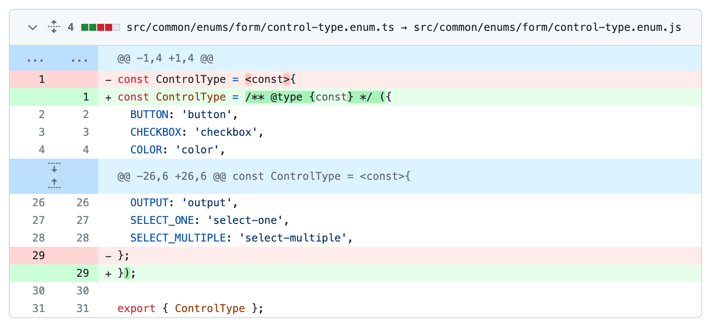
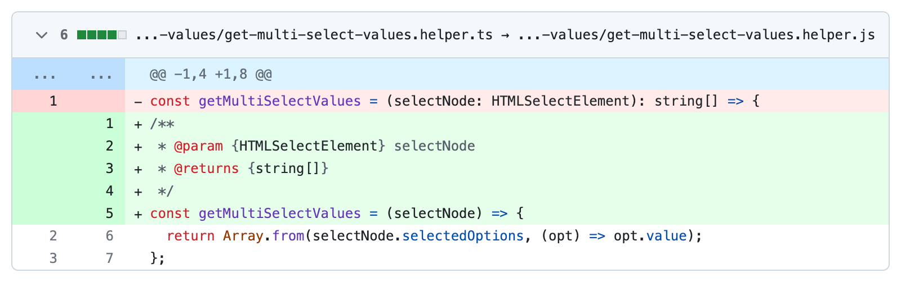
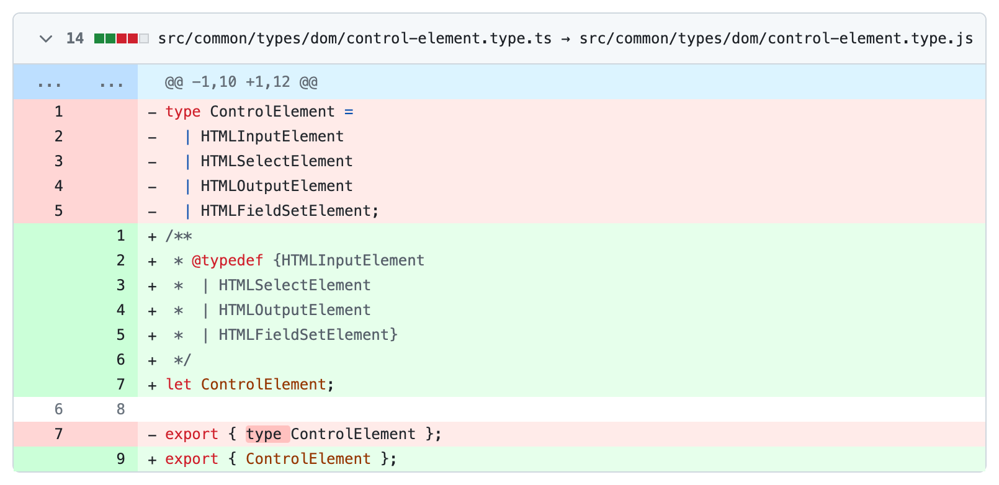
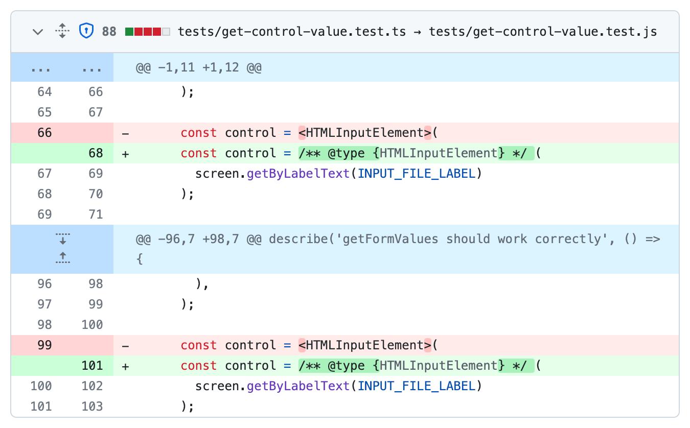
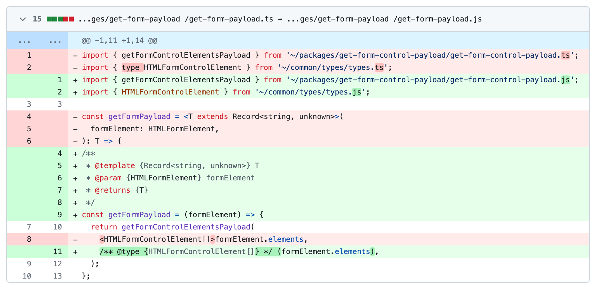
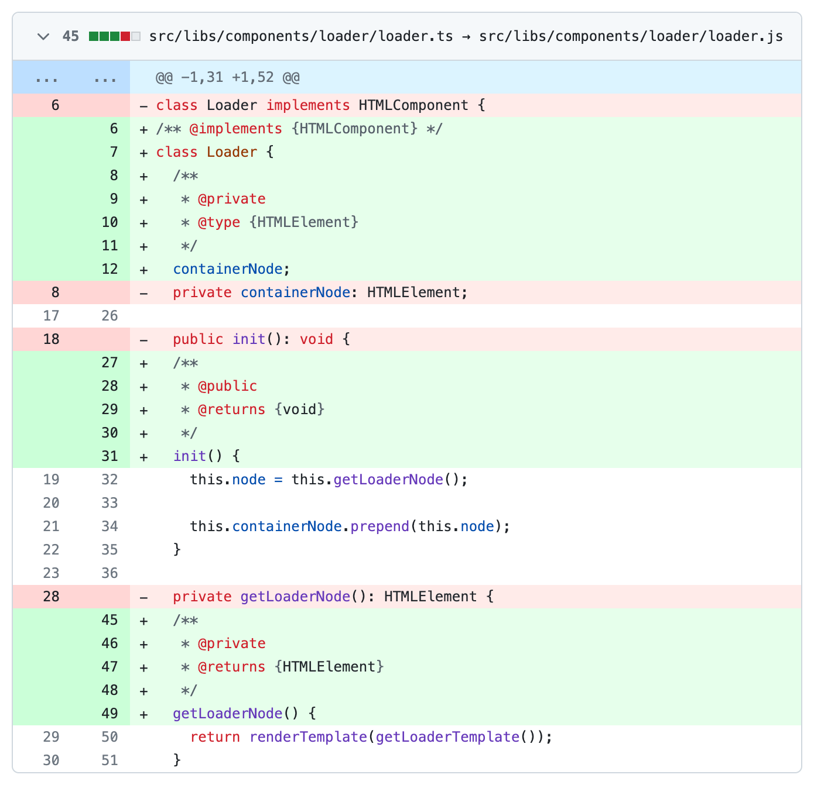
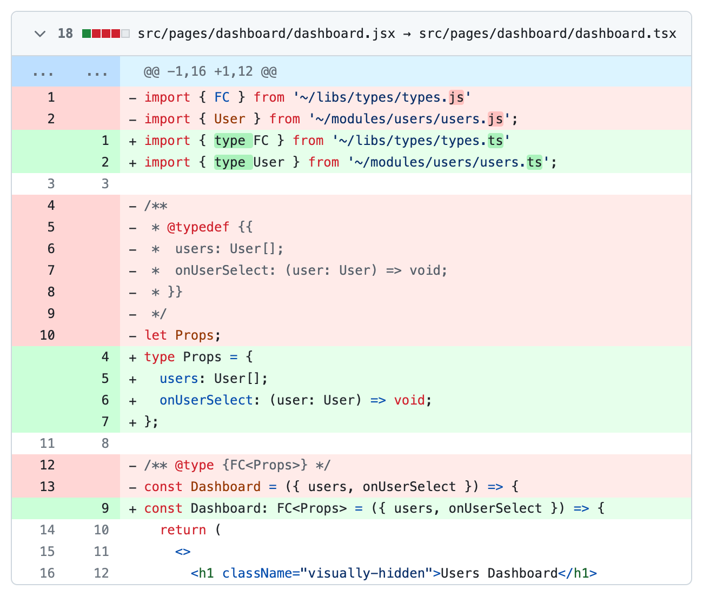

"We will _soon_ migrate to TypeScript, and then..." – how often do you hear this phrase? Perhaps, if you mainly work within a single project or mostly just start new projects from scratch, this is a relatively rare expression for you to hear. For me, as someone working in an outsourcing company, who, in addition to my main project, sees dozens of various other projects every month, it is a quite common phrase from the development team or a client who would like to upgrade their project stack for easier team collaboration. Spoiler alert: it is probably not going to be as soon of a transition as you think (most likely, _never_).

While it may sound drastic, _in most_ cases, this will indeed be the case. Most people who have not undergone such a transition may not be aware of the dozens of nuances that can arise during a project migration to TypeScript. For instance, are you prepared for the possibility that your project build, which took _tens of seconds_ in pure JavaScript, might suddenly start taking _tens_ _of minutes_ when using TypeScript? Of course, it depends on your project's size, your pipeline configuration, etc., but these scenarios are not fabricated. You, as a developer, might be prepared for this inevitability, but what will your client think when you tell them that the budget for the server instance needs to be increased because the project build is now failing due to a heap out-of-memory error after adding TypeScript to the project? Yes, TypeScript, like any other tool, is not free.

On the Internet, you can find a large number of articles about how leading companies successfully migrated their projects from pure JavaScript to TypeScript. While they usually describe a lot of the issues they had during the transition and how they overcame them, there are still many unspoken obstacles that people can encounter which can become critical to your migration.

Despite the awareness among most teams that adding typing to their projects through migration to TypeScript might not proceed as smoothly as depicted in various articles, they still consider TypeScript as the _exclusive and definitive solution_ to address typing issues in their projects. This mindset can result in projects remaining in pure JavaScript for extended periods, and the eagerly anticipated typing remains confined to the realm of dreams. While alternative tools for introducing typing to JavaScript code do exist, TypeScript's overwhelming popularity often casts them into the shadows. This widespread acclaim, justified by the TypeScript team's active development, may, however, prove disadvantageous to developers. Developers tend to lean towards the perception that TypeScript is the _only_ solution to typing challenges in a project, neglecting other options.

Next, we will consider JSDoc as a tool that, when used correctly and understood in conjunction with other tools (like TypeScript), can help address the typing issue in a project _virtually for free_. Many might think that the functionality of JSDoc pales in comparison to TypeScript, and comparing them is unfair. To some extent, that is true, but on the other hand, it depends on the perspective. Each technology has its pros and cons, counterbalancing the other.

Code examples will illustrate a kind of [graceful degradation](https://developer.mozilla.org/en-US/docs/Glossary/Graceful_degradation) from TypeScript to JavaScript while maintaining typing functionality. While for some, this might appear as a form of [progressive enhancement](https://developer.mozilla.org/en-US/docs/Glossary/Progressive_Enhancement). Again, it all depends on how you look at it…

<figure>
  
  <figcaption>TypeScript to JSDoc. My vanilla JavaScript enums.</figcaption>
</figure>

## JSDoc and Its Extensions

[JSDoc](https://jsdoc.app/) is a specification for the comment format in JavaScript. This specification allows developers to describe the structure of their code, data types, function parameters, and much more using special comments. These comments can then be transformed into documentation using appropriate tools.

```js jsdoc
/**
 * Adds two numbers.
 *
 * @param {number} a - The first number.
 * @param {number} b - The second number.
 * @returns {number} The sum of the two numbers.
 */
const getSum = (a, b) => {
  return a + b
}
```

Initially, JSDoc was created with the goal of generating documentation based on comments, and this functionality remains a significant part of the tool. However, it is not the only aspect. The second substantial aspect of the tool is the description of various types within the program: variable types, object types, function parameters, and many other structures. Since the fate of [ECMAScript 4](https://evertpot.com/ecmascript-4-the-missing-version/) was uncertain, and many developers lacked (and still lack to this day) proper typing, JSDoc started adding this much-needed typing to JavaScript. This contributed to its popularity, and as a result, many other tools began to rely on the JSDoc syntax.

An interesting fact is that while the JSDoc documentation provides a list of basic tags, the specification itself allows developers to expand the list based on their needs. Tools built on top of JSDoc leverage this flexibility to the maximum by adding their own custom tags. Therefore, encountering a _pure_ JSDoc setup is a relatively rare occurrence.

<figure>
  
  <figcaption>TypeScript to JSDoc. Function typing.</figcaption>
</figure>

The most well-known tools that rely on JSDoc are [Closure Compiler](https://github.com/google/closure-compiler) (not to be confused with the Closure programming language) and [TypeScript](https://www.typescriptlang.org/). Both of these tools can help make your JavaScript _typed_, but they approach it differently. Closure Compiler primarily focuses on _enhancing_ your `.js` files by adding typing through JSDoc annotations (after all, they are just _comments_), while TypeScript is designed for `.ts` files, introducing its own well-known TypeScript constructs such as `type`, `interface`, `enum`, `namespace`, and so on.

Not from its inception, but starting from [version 2.3](https://www.typescriptlang.org/docs/handbook/release-notes/typescript-2-3.html#errors-in-js-files-with---checkjs), TypeScript began allowing something similar to Closure Compiler – checking type annotations in `.js` files based on the use of JSDoc syntax. With this version, and with each subsequent version, TypeScript not only added support for JSDoc but also incorporated [many of the core tags and constructs](https://github.com/google/closure-compiler/wiki/Annotating-JavaScript-for-the-Closure-Compiler) present in Closure Compiler. This made migration to TypeScript more straightforward. While Closure Compiler is still being updated, used by some teams, and _remains the most effective tool for code compression_ in JavaScript (if its rules are followed), due to support for checking `.js` files and various other updates brought by the TypeScript team, [Closure Compiler eventually lost to TypeScript](https://effectivetypescript.com/2023/09/27/closure-compiler/).

From the implementation perspective, incorporating an understanding of JSDoc notation into TypeScript is not a fundamental change. Whether it is TypeScript types or JSDoc types, ultimately, they both become part of the AST (Abstract Syntax Tree) of the executed program. This is convenient for us as developers because all our everyday tools, such as ESLint (including all its plugins), Prettier, and others, primarily rely on the AST. Therefore, regardless of the file extensions we use, our favorite plugins can continue to work in both `.js` and `.ts` files (with some exceptions, of course).

<figure>
  
  <figcaption>TypeScript to JSDoc. Type Declaration.</figcaption>
</figure>

## Developer Experience

When adding typing to JavaScript code using JSDoc, it is advisable to use additional tools that enhance the development experience.

[eslint-plugin-jsdoc](https://www.npmjs.com/package/eslint-plugin-jsdoc) is a JSDoc plugin for ESLint. This plugin reports errors in case of invalid JSDoc syntax usage and helps standardize the written JSDoc. An important setting for this plugin is the [mode](https://github.com/gajus/eslint-plugin-jsdoc/blob/HEAD/docs/settings.md#mode) option, which offers one of the following values: `typescript`, `closure` (referring to Closure Compiler), or `jsdoc`. As mentioned earlier, JSDoc can vary, and this option allows you to specify which JSDoc tags and syntax to use. The default value is `typescript` (though this has not always been the case), which, given TypeScript's dominance over other tools that work with JSDoc, seems like a sensible choice.

<figure>
  
  <figcaption>TypeScript to JSDoc. Type casting.</figcaption>
</figure>

It is also important to choose a tool for analyzing the type annotations written in JSDoc, and in this case, it will be [TypeScript](https://www.typescriptlang.org/). This might sound strange because, in this article, it seems like we are discussing its replacement. However, we are not using TypeScript for its _primary_ purpose – our files still have the `.js` extension. We will only use TypeScript as a type checking linter. In most projects where TypeScript is used _fully_, there is typically a `build` script responsible for compiling `.ts` files into `.js`. In the case of using TypeScript as a linting tool, instead of a `build` command handling compilation, you will have a command for linting your types.

```json
// package.json

{
  "scripts": {
    "lint:type": "tsc --noEmit"
  }
}
```

If, in the future, a tool emerges that _surpasses_ TypeScript as a linting tool for project typing, we can always replace it in this script.

To make this script work correctly, you need to create a [tsconfig.json](https://www.typescriptlang.org/docs/handbook/tsconfig-json.html) file in your project or add additional parameters to this script. These parameters include [allowJs](https://www.typescriptlang.org/tsconfig#allowJs) and [checkJs](https://www.typescriptlang.org/tsconfig#checkJs), which allow TypeScript to check code written in `.js` files. In addition to these parameters, you can enable many others. For example, to make type checking stricter, you can use [strict](https://www.typescriptlang.org/tsconfig#strict), [noUncheckedIndexedAccess](https://www.typescriptlang.org/tsconfig#noUncheckedIndexedAccess), [exactOptionalPropertyTypes](https://www.typescriptlang.org/tsconfig#exactOptionalPropertyTypes), [noPropertyAccessFromIndexSignature](https://www.typescriptlang.org/tsconfig#noPropertyAccessFromIndexSignature), and more. TypeScript will rigorously check your code even if you are using `.js` files.

The TypeScript team consistently enhances the functionality of TypeScript when working with JSDoc. With almost every release, they introduce both fixes and new features. The same applies to code editors. Syntax highlighting and other DX features provided by TypeScript when working with `.ts` files also work when dealing with `.js` files using JSDoc. Although there are occasional instances where support for certain JSDoc features may come later, many GitHub issues labeled with JSDoc in the TypeScript backlog indicate that the TypeScript team continues to work on improving JSDoc support.

<figure>
  
  <figcaption>TypeScript to JSDoc. Generics.</figcaption>
</figure>

Many might mention the nuance that when using TypeScript solely for `.js` files, you are deprived of the ability to use additional constructs provided by TypeScript. For example: [Enums](https://www.typescriptlang.org/docs/handbook/enums.html), [Namespaces](https://www.typescriptlang.org/docs/handbook/namespaces.html), [Class Parameter Properties](https://www.typescriptlang.org/docs/handbook/2/classes.html#parameter-properties), [Abstract Classes and Members](https://www.typescriptlang.org/docs/handbook/2/classes.html#abstract-classes-and-members), [Experimental (!) Decorators](https://www.typescriptlang.org/docs/handbook/decorators.html), and others, as their syntax is only available in files with the `.ts` extension.

Again, for some, this may seem like a drawback, but for others, it could be considered a benefit, as most of these constructs have their drawbacks. Primarily, during TypeScript compilation to JavaScript, anything related to types _simply disappears_. In the case of using the aforementioned constructs, all of them are _translated_ into less-than-optimal JavaScript code. If this does not sound compelling enough for you to refrain from using them, you can explore the downsides of each of these constructs on your own, as there are plenty of articles on the Internet discussing these issues.

Overall, the use of these constructs is generally considered an anti-pattern. On most of my projects where I use TypeScript to its full extent (with all my code residing in `.ts` files), I always use a custom ESLint rule:

```js jsdoc
// eslint.config.js

/** @type {import('eslint').Linter.FlatConfig} */
const config = {
  rules: {
    'no-restricted-syntax': [
      'error',
      {
        selector:
          'TSEnumDeclaration,TSModuleDeclaration,TSParameterProperty,ClassDeclaration[abstract=true],Decorator',
        message: 'TypeScript shit is forbidden.',
      },
    ],
  },
}
```

This rule prohibits the use of TypeScript constructs that raise concerns.

When considering what remains of TypeScript when applying this ESLint rule, essentially, only the _typing_ aspect remains. In this context, when using this rule, leveraging [JSDoc tags and syntax provided by TypeScript](https://www.typescriptlang.org/docs/handbook/jsdoc-supported-types.html) for adding typing to `.js` files is almost indistinguishable from using TypeScript with `.ts` files.

<figure>
  
  <figcaption>TypeScript to JSDoc. Class and its members.</figcaption>
</figure>

As mentioned earlier, most tools rely on AST for their operations, including TypeScript. TypeScript does not care whether you define types using TypeScript's keywords and syntax or JSDoc tags supported by TypeScript. This principle also applies to ESLint and its plugins, including the [typescript-eslint](https://typescript-eslint.io/getting-started/) plugin. This means that we can use this plugin and its powerful rules to check typing even if the entire code is written in `.js` files (provided you enabled the [appropriate parser](https://typescript-eslint.io/packages/parser)).

Unfortunately, a significant drawback when using these tools with `.js` files is that some parts of these tools, such as specific rules in typescript-eslint, rely on the use of specific TypeScript keywords. Examples of such rules include [explicit-function-return-type](https://typescript-eslint.io/rules/explicit-function-return-type/), [explicit-member-accessibility](https://typescript-eslint.io/rules/explicit-member-accessibility/), [no-unsafe-return](https://typescript-eslint.io/rules/explicit-member-accessibility/), and others that are tied explicitly to TypeScript keywords. Fortunately, there are not many such rules. Despite the fact that these rules could be rewritten to use AST, the development teams behind these rules are currently reluctant to do so due to the increased complexity of support when transitioning from using keywords to AST.

## Conclusion

JSDoc, when used alongside TypeScript as a linting tool, provides developers with a powerful means of typing `.js` files. Its functionality does not lag significantly behind TypeScript when used to its _full potential_, keeping all the code in `.ts` files. Utilizing JSDoc allows developers to introduce typing into a pure JavaScript project right now, without delaying it as a distant dream of a full migration to TypeScript (which most likely will never happen).

Many mistakenly spend too much time critiquing the JSDoc syntax, deeming it ugly, especially when compared to TypeScript. It is hard to argue otherwise, TypeScript's syntax does indeed look much more concise. However, what is truly a mistake is engaging in empty discussions about syntax instead of taking any action. In the end, you will probably want to achieve a similar result, as shown in the screenshot below. Performing such a migration is significantly easier and more feasible when transitioning from code that already has typing written in JSDoc.

<figure>
  
  <figcaption>JSDoc to TypeScript. Possibly a long-awaited migration. React Component.</figcaption>
</figure>

By the way, many who label the JSDoc syntax as ugly, while using TypeScript as their sole primary tool, after such remarks, nonchalantly return to their `.ts` files, fully embracing TS Enums, TS Parameter Properties, TS Experimental (!) Decorators, and other TS constructs that might raise questions. Do they truly believe they are on the right side?

Most of the screenshots were taken from the migration of `.ts` files to `.js` while preserving type functionality in my library [form-payload](https://github.com/what1s1ove/form-payload) (here is the [PR](https://github.com/what1s1ove/form-payload/pull/70)). Why did I decide to make this migration? Because I wanted to. Although this is far from my only experience with such migrations. Interestingly, the sides of migrations often change (migrations from `.js` to `.ts` undoubtedly occur more frequently). Despite my affection for TypeScript and its concise syntax, after several dozen files written/rewritten using JSDoc, I stopped feeling any particular aversion to the JSDoc syntax, as it is _just syntax_.

Summing up: JSDoc provides developers with real opportunities for gradually improving the codebase without requiring a complete transition to TypeScript from the start of migration. It is essential to remember that the key is not to pray to the TypeScript-God but to start taking action. The ultimate transition to using TypeScript fully is possible, but you might also realize that JSDoc is more than sufficient for successful development, as it has its advantages. For example, here is what a "JSDoc-compiler" might look like:

```js
// bundler.js

await esbuild.build({
  entryPoints: [jsMainEntryPoint],
  minify: true, // 👌
})
```

Give it a try! Do not stand still, continually develop your project, and I am sure you will find many other benefits!
