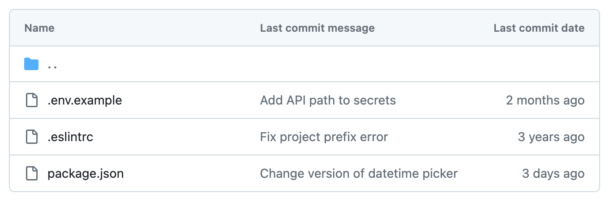
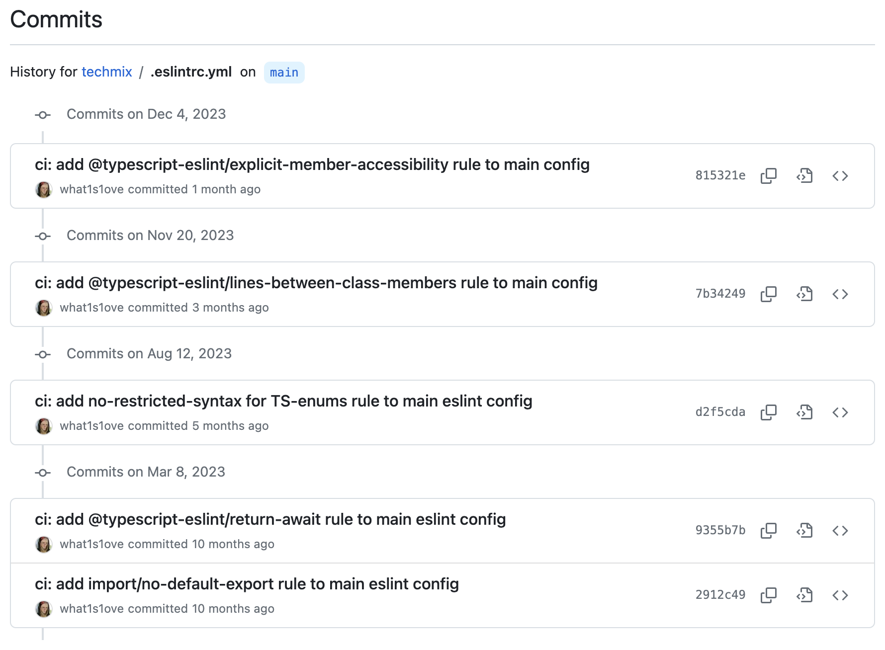

Many developers approach “_old_” projects with great reluctance. An old project can be defined as one in which the majority of its components are written using outdated approaches, obsolete rules of linters, old versions of libraries, or an outdated development platform. There can be various reasons why projects _age_ – strict release deadlines that only include business features, a lack of understanding on the business side of the project regarding the necessity of investing time _just like that_, and simply the indifference towards the technical side of the project. However, when a situation truly starts to heat up, for example, an urgent need to migrate to the Node.js LTS version or promptly update a library version because further development is impossible, the time, motivation, and explanation of why it is necessary to do this will be found.

When the time for updating the platform version and library versions inevitably comes, many developers mistakenly overlook linters. Often, configuring a linter and its rules is perceived as a one-time task, typically done at the start of the project, and it is assumed that after the initial setup, one can forget about it forever. Linters and their rules evolve, the same as any other libraries. New configurations, rules, and changes to existing rule options emerge. Depending on how and when you configured your linter, it will impact the quality of your code. After all, linters have long been not just about coding style but also about the correctness of code, staying up-to-date with new development approaches, and leveraging the language's new features.

Consequently, if you adhere to the approach that a linter needs to be configured exactly once at the project's outset, then most likely the quality of your code will remain at the level it was when you initially configured the linter.

<figure>
  
  <figcaption>A linter that does not receive enough love.</figcaption>
</figure>

Many developers are hesitant to update a linter and its rules because they fear that it may lead to various issues. Often, they worry that adding or modifying rules will require editing all the old code in files that may not have been touched for months or even years. This concern is particularly pronounced in large projects. Even if a rule pertains to more stylistic aspects and theoretically should not break anything, a pull request that applies the updated/new linter rule to the entire project can result in potentially several thousands of changed files, depending on the project's size. Reviewing such changes can be quite a task, and there might not even be a review, as such code reviews are rightfully considered unacceptable.

Quality implementation of updated/new linter rules should follow a different process. First and foremost, the goal is to ensure that only all new files (or preferably new and modified ones) entering the codebase as part of a single code review adhere to the changed/new linter rule. With this approach, the process of modifying or adding rules becomes simple and safe, as there is no need to immediately edit the entire project to comply with the changes in linter. The application of linter updates will occur gradually, with each pull request incorporating more and more files that align with the new changes.

Indeed, in this article, we will further explore how to approach the implementation of this process effectively.

## Enhanced Config

All modern linters incorporate functionality for extending configurations, although the syntax for this is often implemented differently. Taking [ESLint](https://eslint.org/) as an example, in its latest versions, the primary extension method is through the use of the [spread operator](https://developer.mozilla.org/en-US/docs/Web/JavaScript/Reference/Operators/Spread_syntax). Let's take a look at an example:

```js
// eslint.config.js

const config = {
  languageOptions: {
    parserOptions: {
      ecmaVersion: 'latest',
      sourceType: 'module',
    },
  },
  rules: {
    'arrow-parens': ['error', 'always'],
  },
}

const configs = [config /* other ESLint plugins can be used here */]

export default configs
```

To extend this configuration, you can do the following:

```js
// eslint.enhanced.config.js

import { default as baseConfigs } from './eslint.config.js'

const config = {
  rules: {
    semi: ['error', 'never'],
  },
}

const configs = [...baseConfigs, config]

export default configs
```

As we can see from the example, extending the base config using the spread operator is quite simple and clear. The name of this config can be anything, allowing us to pass the desired config name to the linter. Information about this will be provided below.

Another common way to extend configs in linters is using the `extends` key in the configuration file. Let's take [StyleLint](https://stylelint.io/) as an example:

```js
// stylelint.config.js

const config = {
  extends: ['stylelint-config-standard'],
}

export default config
```

The values in the `extends` key array can be absolute or relative paths. Absolute paths are used for configs provided by package managers, for example, [NPM](https://www.npmjs.com/), as shown in the example above. On the other hand, relative paths are used to extend local configuration files. The mechanism is similar to using the spread operator for extending ESLint configs.

Both using the spread operator and the `extends` key in the linter's configuration file are popular methods for implementing the config extension mechanism. However, it is worth noting that the spread operator mechanism is becoming increasingly popular among linters in recent times. In earlier versions, ESLint also supported the extension mechanism through the `extends` key in the configuration file. Although this mechanism can still be used in ESLint, it is not recommended. Moreover, ESLint's authors plan to deprecate support for the extension mechanism via the `extends` key in future releases.

Another crucial aspect common to all linters is the CLI option `--config` (or `-c`), which allows us to explicitly specify the configuration to use for linting files. By default, all linters have a set of standard configuration file names they will look for in the project when the linter is run. For example, ESLint searches for the file `eslint.config.js`, while StyleLint looks for `stylelint.config.js`. Since most projects rarely have more than one linter configuration file, the `--config` CLI option is not frequently used, but it is essential not to overlook it.

Since we want to gradually implement the updated/new rule in the project, we can leverage the config extension mechanism to use the existing linter config and extend it with a newly created config. This new config will include all settings and rules from the base config and will also be extended with updated/new rules. This allows us to use the base linter config to lint all old files as before, and for all new files that should be introduced into the codebase via a pull request, we can lint them using the enhanced linter config and the CLI option `--config`.

We have covered the part about extending the config. Now, let's understand how to apply updated/new rules only to files involved in code reviews.

## Continuous Integration Changes

In most projects, before other people start reviewing code in a pull request, it needs to pass machine reviews from various linters and tests. This process is commonly referred to as [Continuous Integration](https://en.wikipedia.org/wiki/Continuous_integration) (or CI for short). There are numerous tools available to help set up this process. In this article, we will use [GitHub Actions](https://docs.github.com/en/actions), which is also the most popular tool for configuring the CI process on GitHub. However, the principles can be applied with any CI tool.

The simplest CI GitHub Actions for linting JavaScript files can look like this:

```yml
# .github/workflows/ci.yml

name: Continuous Integration

on:
  pull_request:
    branches:
      - main

jobs:
  ci:
    runs-on: ubuntu-latest
    steps:
      - name: Code Checkout
        uses: actions/checkout@v4

      - name: Install NodeJS
        uses: actions/setup-node@v4
        with:
          node-version-file: .nvmrc

      - name: Install Dependencies
        run: npm install

      - name: Lint JS
        run: npx eslint .
```

If you are not familiar with the GitHub Actions syntax, you can refer to it [here](https://docs.github.com/en/actions/using-workflows/workflow-syntax-for-github-actions).

Currently, the main step in the action is the "Lint JS" step, which simply runs ESLint on all JS files in the project. You can learn more about ESLint's CLI capabilities [here](https://eslint.org/docs/latest/use/command-line-interface).

Now, we need to add additional steps that include checking for updated/new rules. The simplest implementation of this would look like the following:

```yml
# .github/workflows/ci.yml

# ...
# CI GitHub Action and its configuration
# ...

- name: Get Changed Files
  id: changed-files
  uses: tj-actions/changed-files@v42

- name: Lint JS with Enhanced Rules
  run: npx eslint --config eslint.enhanced.config.js ${ { steps.changed-files.outputs.added_files } }
```

We need to add two additional steps. The first one is to retrieve all new files, and the second one is to run the enhanced config only on the new files. In this example the third-party GitHub Action called [changed-files](https://github.com/tj-actions/changed-files) is used to obtain the new files. In the [GitHub Marketplace for Actions](https://github.com/marketplace?type=actions), there is a considerable number of similar actions with similar functionality. You can choose the one that suits you best, as the functionality is more or less the same for all of them.

It is important to note that in this example, we apply the enhanced config only to new files that will be in the pull request. Depending on the agreements within your team, such as the average size of your pull requests, it is strongly recommended to include not only new files but also modified ones when linting with the enhanced config. This will expedite the process of achieving 100% coverage of the project with updated/new rules.

Also, due to the simplicity of the example, a straightforward GitHub Actions workflow was used where all steps are performed within a single job. While this works, it is recommended to decompose the tasks performed by a GitHub Action into multiple jobs when it makes sense to divide them. This can enhance readability and maintainability of your workflows.

## Conclusion

In modern development, where technologies are constantly evolving, keeping linters up-to-date becomes crucial for maintaining high code quality. Many developers, while focusing on platform and library updates, overlook the importance of updating linters. However, linters play a role not only in maintaining code style but also in ensuring its correctness and adherence to modern development practices.

The fear of updating linters is often associated with potential issues, such as the need to make changes to extensive old code. However, implementing linter updates can be done more safely by following methods of gradual modification, applying updated/new rules to new or modified files. This process ensures a gradual alignment of the entire project with updated standards, minimizing potential issues and providing a smooth adaptation process.

An important element of successfully updating a linter is the use of configuration extension functionality. Modern linters, such as ESLint, provide extension mechanisms, allowing updates to be gradually introduced by extending the existing config with updated/new rules. This approach ensures the ease of alignment for both existing code and new changes, contributing to maintaining a high coding standard in the project.

Additionally, once you achieve 100% coverage of the project with the updated/new rule in the enhanced linter config, do not forget to move this rule to the main config. This ensures that the rule is consistently applied across the entire project and helps maintain a unified code style.

<figure>
  
  <figcaption>A linter that receives enough love (but it can always be better!)</figcaption>
</figure>

Try to incorporate this approach into your daily development routine, as now you know that it is not very complicated to do. I am sure you, your team, and your project will appreciate this change, as it embodies not only technical efficiency but also the flexibility required in the modern dynamic development environment.

You can find complete examples of using this approach [here in the repository](https://github.com/what1s1ove/enhanced-config).
